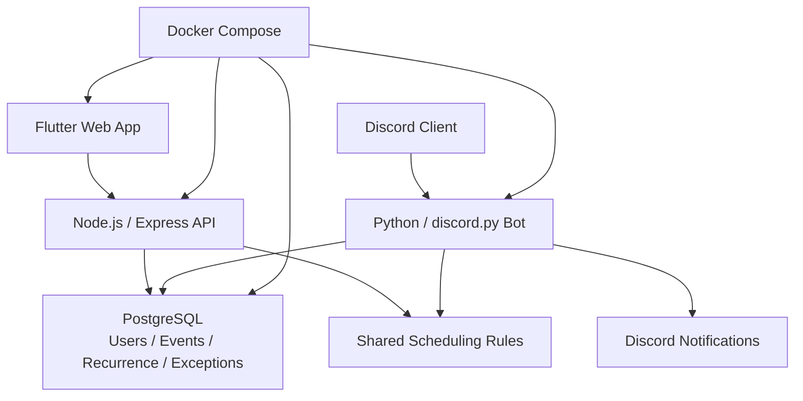

## Overview

CalBot was a personal project built across November and December 2025. It connected a browser-based calendar application and a Discord bot into one scheduling system instead of treating them as separate tools. The goal was not just to render events on a calendar, but to make the same scheduling rules work across two very different interaction surfaces.

I built the calendar UI with Flutter Web, the REST API with Node.js and Express, and the Discord bot as a separate Python service using discord.py. I also designed the PostgreSQL data model for recurring events, exceptions, and per-occurrence completion state, and used Docker Compose to keep the multi-service runtime reproducible.

### At a Glance

- Period: 2025.11 - 2025.12
- Scope: personal scheduling platform spanning web calendar, API, and Discord bot
- Ownership: frontend, API, Discord integration, data model, and containerized runtime
- Core value: multi-interface consistency, durable recurrence modeling, product completeness, and reproducible execution

## Problem

The main problem was not drawing a calendar. It was making multiple interfaces operate on the same scheduling model without creating separate sets of rules. The web app naturally favored visual editing, forms, and direct calendar interaction. Discord favored concise commands and natural language input. Those interaction styles could differ, but event creation, recurrence, editing behavior, and notification logic still had to remain consistent.

Recurring schedules added most of the real complexity. A useful scheduling system needs more than daily repetition: it needs weekday-based rules, monthly patterns, end conditions, single-occurrence deletion, and instance-level completion tracking. Without a stronger underlying model, those features quickly turn into fragile per-screen behavior.

The practical question was how to keep the domain model unified while allowing the product to feel native in both the browser and Discord, and how to support realistic recurrence rules without making the overall system harder to extend.

## My Role

I was directly responsible for:

- Building the Flutter Web calendar and schedule management UI
- Organizing state, routing, and settings flows with GetX
- Designing and implementing the Node.js and Express CRUD API
- Building the Python and discord.py bot service
- Designing PostgreSQL schemas for events, users, recurrence rules, exceptions, and completion tracking
- Defining Discord command and natural language scheduling flows
- Setting up the Docker Compose runtime for the multi-service stack
- Implementing recurrence exception handling and per-occurrence completion behavior

This was an end-to-end product project rather than a single-service exercise.

## Architecture

Flutter Web handled the calendar view, agenda, schedule forms, and user settings. The Node.js and Express API handled CRUD operations, validation, and access to persisted schedule data. A separate Python bot service interpreted Discord commands and natural language input, then translated them into scheduling operations and notifications. PostgreSQL stored the authoritative data for events, recurrence rules, exception dates, completion history, user settings, and Discord server configuration.

The point of this structure was not just technical separation. It was to prevent the web and Discord experiences from drifting into separate products. The interfaces could behave differently, but the scheduling rules and stored data needed one source of truth. Docker Compose made that multi-service system easier to run consistently.

## Key Decisions

### Using one shared scheduling model across web and Discord

If the web app and the bot evolve independently, they quickly accumulate different assumptions. I started from the domain model instead: events, recurrence, exceptions, and completion state. The browser and the bot then became two consumers of the same scheduling rules.

That reduced duplication and kept behavior aligned across channels.

### Treating recurrence as a data-model concern

Recurrence is not just a UI control. It is a persistence and interpretation problem. I used RFC 5545-compatible recurrence rules plus explicit exception and completion data so the system could represent both the series and the state of individual occurrences.

That made single-occurrence deletion and per-instance completion far easier to reason about.

### Designing the Discord bot as a first-class interface

The Discord bot was not only a reminder endpoint. It needed to create, query, and surface schedules in a way that felt useful on its own. I therefore converted both command-based and natural language input into the same scheduling operations rather than treating Discord as a separate feature silo.

This let the product support real schedule management from chat without splitting the data model.

### Stabilizing the stack with Docker Compose

Multiple runtimes create friction if each one is started, configured, and connected differently. I containerized the stack and tied it together with Docker Compose so the runtime contract between frontend, API, bot, and database stayed explicit.

For a personal project, that was less about scale and more about keeping the system reproducible and easier to evolve.

## Challenges

### Recurrence exceptions and occurrence-level state

Deleting one instance from a recurring series or marking a single occurrence complete introduces a second layer of state beyond the base recurrence rule. I separated the series definition from exception and completion records so the system could preserve both the recurrence logic and the history of individual instances.

### One domain, two very different interaction patterns

The browser favors structured forms and direct editing. Discord favors short text commands and conversational input. I let each interface keep its own interaction model while ensuring validation and persistence still converged on the same scheduling rules.

### Closing the gap between a demo and a usable scheduling product

The small details matter in calendar software. All-day events, colors, notes, locations, responsive layouts, completion styling, and smart defaults all affect whether the system feels coherent. I treated those details as part of the product engineering work rather than optional polish.

## Impact

- Built a personal scheduling platform across Flutter Web, Node.js, Python, and PostgreSQL
- Supported RFC 5545-compatible recurrence, exception dates, and per-occurrence completion tracking
- Unified browser and Discord schedule handling under one shared data model
- Structured the system as separate frontend, API, bot, and database services with clear responsibilities
- Made the multi-service runtime reproducible with Docker Compose
- Delivered event creation, editing, querying, and notification workflows as one connected product
