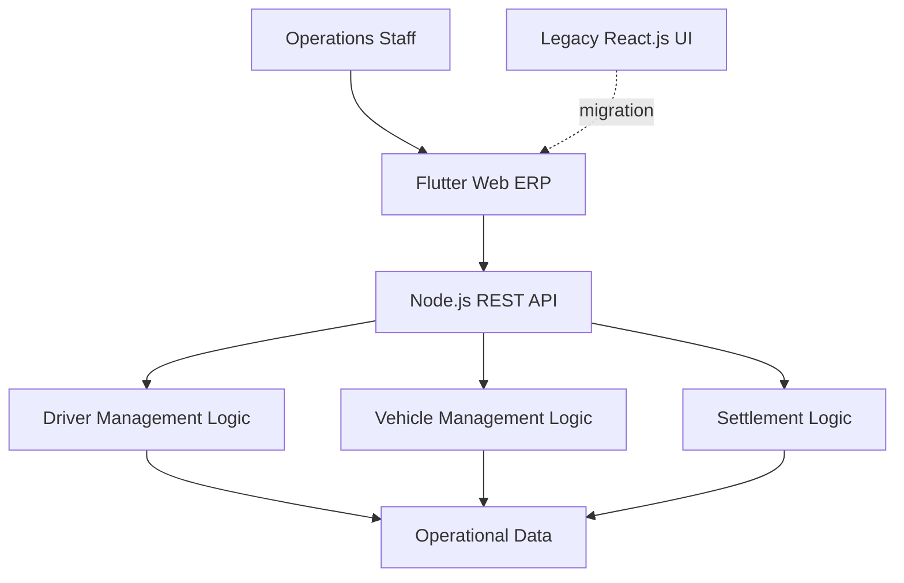

## Overview

This project improved an internal ERP platform for a corporate taxi company over roughly five months in early 2022. The work combined a frontend migration from React.js to Flutter Web with backend restructuring around a Node.js REST API and the core business logic required by the platform.

The important part was not the framework change by itself. Driver, vehicle, and settlement workflows were operationally connected, so the migration only made sense if screen structure, API contracts, and data flow were clarified together. I treated the frontend migration and backend cleanup as one architectural problem rather than two unrelated tasks.

The source code is private. This case study focuses on the structure and engineering decisions behind the work.

### At a Glance

- Period: 2022.01 - 2022.05
- Product type: ERP for taxi company operations
- Ownership: Flutter Web migration, Node.js REST API design, and core business logic
- Core domains: driver management, vehicle management, and settlement management

## Problem

The existing operations product was built on React.js, but as features accumulated, the screen structure and state flow became harder to extend safely. Driver, vehicle, and settlement areas looked like separate menus, yet in practice they belonged to one connected operational workflow. A change in one part of the product could easily ripple into other screens and API behavior.

The issue was not only in the UI. When contracts between the frontend and backend are loosely defined, the frontend starts carrying screen-specific exceptions and ad hoc transformation logic, while the backend drifts toward serving screens rather than enforcing business rules. That makes the system harder to reason about whenever features are added or existing workflows change.

So the goal was broader than rewriting the frontend. The platform needed a cleaner Flutter Web structure, a better-defined Node.js REST API, and a tighter data flow model so the operational product would become more predictable to extend and maintain.

## My Role

I was directly responsible for:

- Migrating the operations product from React.js to Flutter Web
- Designing the Node.js REST API
- Implementing core business logic for driver, vehicle, and settlement management
- Defining API specifications between frontend and backend
- Reviewing and optimizing the data flow used by the main operational screens

This was a combined frontend migration and backend structure effort, not just a UI rewrite.

## Architecture

Operations staff used a Flutter Web interface to manage driver, vehicle, and settlement workflows. The frontend was restructured to separate screen responsibilities more clearly, while the Node.js REST API handled business logic for each operational domain. The point was to stop pushing domain rules into the UI and instead let the backend expose explicit contracts that the frontend could rely on.

That architecture served two purposes at once. It made the migration away from the legacy React.js UI more controlled, and it reduced the amount of hidden coupling between screens and backend behavior.

## Key Decisions

### Using the migration to fix structural issues

A frontend migration can easily become a surface-level rewrite that preserves the same underlying complexity. I treated the move to Flutter Web as a chance to rework how screens were structured and how state was organized, so the platform would become easier to evolve after the migration rather than simply different in technology.

### Designing the API around domains rather than screens

Driver, vehicle, and settlement flows are operationally linked. If the API grows around screen-by-screen convenience endpoints, the business rules become fragmented. I instead shaped the REST API around those domains so the backend remained the consistent source of operational logic.

### Making the API specification explicit

Administrative systems accumulate list, detail, edit, and status-transition flows quickly. Informal agreements between frontend and backend do not scale well in that environment. By defining request and response contracts explicitly, I gave both sides a stable coordination surface for building and changing features.

### Reducing over-coupled data flow

ERP screens become difficult to maintain when they fetch too much, too little, or differently shaped data at each step. I reviewed the main flows and simplified the request-response boundaries so each screen handled the data it actually needed, with fewer hidden dependencies on backend implementation details.

## Challenges

### Improving the product without destabilizing operations

An internal ERP is part of the company's daily work, so structural cleanup cannot come at the cost of operational reliability. I focused the migration around the most important domains and used clearer API contracts to reduce regression risk while still improving the codebase shape.

### Centralizing business rules that had been spread across screens

Operational rules often leak into multiple UI paths over time. That makes changes risky because behavior is duplicated in several places. I moved the core rules into the Node.js REST API so the frontend could focus on interaction and presentation while the backend handled the logic consistently.

### Making data flow easier to reason about

List, detail, edit, and status flows repeat across administrative products. If the data boundaries are unclear, state management becomes expensive to maintain. By tightening the API contracts and simplifying payload expectations, I reduced the coordination cost between frontend and backend.

## Impact

- Migrated the operations product from React.js to Flutter Web and improved the frontend structure
- Designed a Node.js REST API and implemented the core business logic behind the ERP
- Delivered driver, vehicle, and settlement management capabilities
- Defined clearer API specifications for frontend-backend coordination
- Optimized data flow so the main operational screens became easier to extend and maintain
