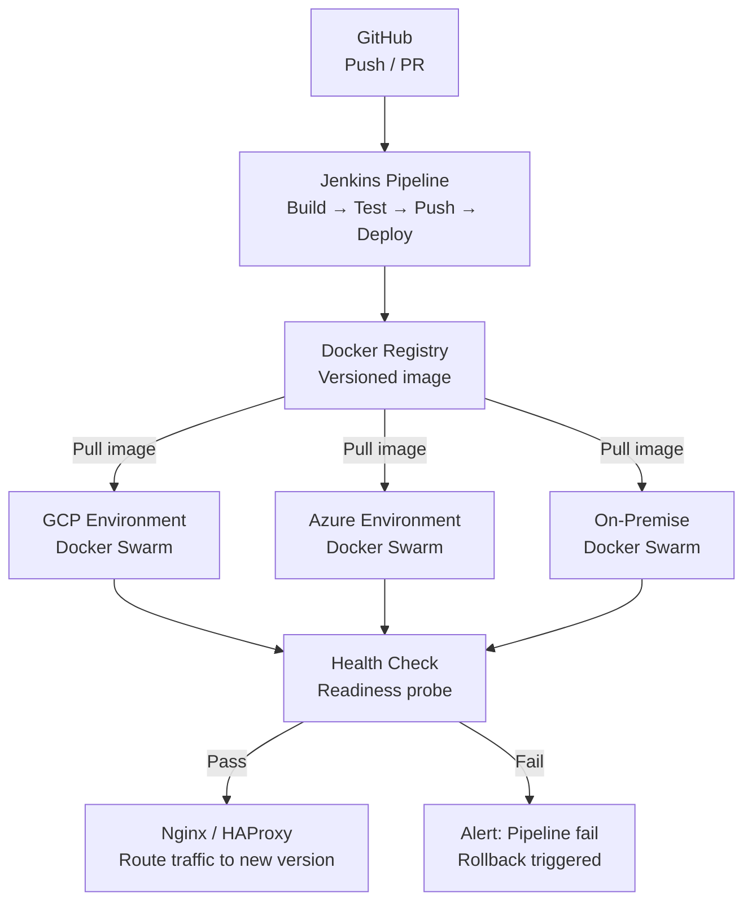

## Overview

This project covers the infrastructure and deployment automation work at Fatos across the full lifecycle of the mobility platform. The starting point was a platform deployed through environment-specific manual scripts, accumulated configuration drift, and coordination-heavy release processes. The outcome was a fully containerized platform with Jenkins-driven pipelines, consistent deployment across three environments, and measurably faster, more reliable releases.

## Problem

The platform ran across three distinct infrastructure environments: GCP, Azure, and on-premise servers. Each had independently developed its own deployment scripts, tool versions, and configuration patterns. Deploying a service update required navigating this inconsistency manually — adapting the procedure for the target environment, coordinating timing between team members, and confirming health by observation.

Two structural problems made this worse over time.

**No shared deployment artifact.** Each service was deployed by running environment-specific scripts that pulled source code and restarted processes in place. Source code drift between environments was a recurring cause of bugs that only appeared in production.

**No automated post-deployment verification.** A deployment was "done" when the script exited with code 0. Whether the service was actually running correctly was a separate question with no automated answer.

## My Role

I owned backend infrastructure, containerization, and CI/CD pipeline design end-to-end. This covered writing Dockerfiles and Docker Compose configurations, building Jenkinsfiles for each service, configuring Docker Swarm orchestration, designing Nginx and HAProxy configurations, and implementing health check and alerting mechanisms for production visibility.

## Architecture

Each service has a Dockerfile that produces a versioned image. Jenkins builds the image, runs tests, pushes to the registry, and orchestrates deployment to the target environment. Docker Swarm handles rolling updates within each environment. Post-deployment health checks are part of the Jenkins stage — traffic is only routed to the new version once the service passes readiness probes.

## Key Decisions

### Docker Swarm over Kubernetes

Kubernetes provides more primitives: sophisticated scheduling, network policies, auto-scaling controllers. But running a Kubernetes control plane requires operational attention — managing the control plane, understanding its failure modes, and keeping the cluster healthy — that was not justified for a small engineering team. Docker Swarm provided the orchestration we needed (rolling updates, health-check restarts, multi-node deployment) with an operational surface small enough to be managed by a backend engineer.

The tradeoff was reduced scheduling sophistication and a smaller ecosystem. For our scale, those weren't active constraints.

### Containerization as the deployment contract

Before containers, deploying meant SSH-ing to a server, pulling the latest code, and restarting the process. This made environment drift nearly inevitable: library versions, system packages, and configuration files accumulated differences independently across GCP, Azure, and on-premise.

Using a Docker image as the artifact created a clear boundary: the image was built once in CI, tested in the same environment it would run in, and that same image was deployed everywhere. Environment-specific values (database URLs, API keys, feature flags) were injected as environment variables at runtime, keeping the image environment-agnostic.

### Health check as a pipeline gate

Treating health as a gate rather than a signal was a deliberate design choice. If a deployment is unhealthy and the pipeline continues, the unhealthy service starts serving traffic and the problem surfaces during an incident. If the pipeline blocks on health, the failure is visible immediately at the deployment stage, before any user traffic reaches the new version.

## Challenges and Solutions

### Deployment consistency across three environments

GCP, Azure, and on-premise had different network configurations and firewall rules, and each had its own accumulated deployment tooling. Standardizing these was not purely a Docker problem — we also needed to normalize how environment variables were managed, how secrets were injected, and how deployment status was reported.

We built a Jenkins shared library that abstracted environment-specific commands behind a common interface. Environment values were stored in Jenkins credentials and injected at deploy time. This reduced the unique deployment paths from three divergent scripts to one pipeline with environment parameters.

### Surfacing startup failures at deploy time

Node.js services sometimes started their process cleanly while silently misconfigured. A missing environment variable that was only accessed on a specific code path would not surface until that path was hit. A database connection configured for lazy initialization would appear healthy until the first database call.

We implemented a `GET /health` endpoint in each service that verified all critical dependencies synchronously at startup: database connectivity, required environment variable presence, and any external service reachability. Jenkins polled this endpoint after each deployment step, waiting for a 200 response before marking the stage complete. Failures that had previously reached production were now caught at pipeline time.

## Impact

Measured over the operational lifecycle at Fatos (2022–2025):

- Deployment time per service: **~70% reduction** after CI/CD automation and containerization
- Release consistency: environment-specific script divergence eliminated across GCP, Azure, and on-premise
- Production failures from deployment errors: reduced through pipeline-level health check gates
- Infrastructure: operated across **three environments** with unified tooling and process
- Operational response time: improved through health check integration and structured failure alerting
