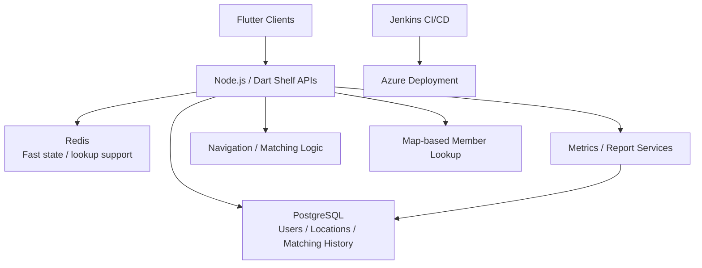

## Overview

This project, delivered at Fatos from June 2022 to December 2023, was a map-based member management, matching, and navigation system built across three closely related products. The real engineering value was not in treating them as three isolated deliveries, but in identifying their common domain and consolidating them into one reusable foundation.

I designed the system across Flutter clients, Node.js and Dart Shelf services, PostgreSQL and Redis data structures, Jenkins-based CI/CD, and Azure operations. The result was a platform that supported member lookup, location-based workflows, matching, navigation, and reporting while also improving reuse and reducing repeated implementation effort across similar products.

Source code cannot be shared. This case study focuses on system structure and engineering judgment.

### At a Glance

- Period: 2022.06 - 2023.12
- Scope: shared architecture for three related map-based products
- Ownership: system design, backend, data model, CI/CD, deployment, and operations
- Core value: reuse, consistency, responsiveness, and operational visibility

## Problem

The challenge was not just to ship a single feature set. There were multiple similar projects with overlapping needs, and maintaining each of them as an isolated implementation would have made every new feature and every operational change more expensive over time.

At the same time, map-based member lookup, matching, and navigation are response-sensitive workflows. Users notice latency immediately. Operational stakeholders also needed metrics, statistics, and reporting. The platform therefore had to balance responsive user-facing behavior with a maintainable operating model across multiple projects.

The key question was how to preserve a shared foundation without ignoring the differences between projects, and how to support both user workflows and operational visibility inside one coherent system.

## My Role

I was directly responsible for:

- Designing and building the system with Flutter, Node.js, and Dart Shelf
- Structuring PostgreSQL and Redis data models and improving response-sensitive lookup performance
- Implementing location-aware services, member lookup, matching, and navigation flows
- Building service metrics, statistics, and reporting capabilities
- Establishing Jenkins-based CI/CD
- Deploying and operating the system in Azure
- Defining the shared architecture that made similar projects reusable instead of isolated

This was not only a feature implementation role. It was a system-level ownership role focused on turning several related projects into a maintainable product family.

## Architecture

Flutter clients handled the map UI, member lookup, matching requests, and navigation flows. Backend APIs built with Node.js and Dart Shelf served user state, location lookup, matching logic, and operational statistics. PostgreSQL acted as the system of record for users, members, matching history, and location data. Redis supported quick-access state and response-sensitive lookup behavior.

The architectural goal was not just technical separation. It was to preserve a clear shared domain and delivery model so all three projects could evolve from the same base instead of diverging into separate systems again. Jenkins and Azure were part of that same standardization effort: reuse had to exist in operations, not only in source code.

## Key Decisions

### Unifying three projects under one shared model

Building similar features separately can feel faster in the short term, but it accumulates maintenance cost quickly. I chose to define shared domain models and API patterns first, then let project-specific differences live at the composition or configuration level.

That decision mattered because it created durable boundaries. It made it easier to tell which parts of the system were genuinely shared and which parts were project-specific extensions.

### Splitting durable data from fast-access state

Location-oriented systems need both correctness and speed. PostgreSQL is strong for durable records and historical tracking. Redis is useful when some response paths need faster access to current or frequently-used state.

I used PostgreSQL as the authoritative store for users, locations, and matching history, while Redis supported quick lookup paths where responsiveness mattered. That division made optimization work more targeted and easier to reason about.

### Designing operations into the product

Metrics and reporting are often deferred until after launch, but that creates blind spots. I included service metrics, statistics, and reporting within the platform scope from the beginning.

That made the system more operable and gave the team a way to understand usage patterns and compare outcomes across related projects, rather than relying only on anecdotal feedback.

### Standardizing CI/CD and deployment

If three similar projects are built and shipped differently, the value of architectural reuse drops quickly. I built Jenkins-based CI/CD and standardized Azure delivery flows so that teams could keep the release model consistent even when project requirements varied.

This reduced repeated operational work and lowered the chance that project-specific deployment drift would erode the benefits of consolidation.

## Challenges

### Consolidation without over-generalization

The projects were similar enough to share a foundation, but not identical enough to force into one rigid implementation. Too much generalization would have added unnecessary complexity. Too little would have recreated the original duplication problem.

I handled that by keeping shared domain and data structures strong while isolating only the parts that truly needed variation.

### Responsiveness in map-based workflows

Member lookup, location-driven flows, matching, and navigation are all features where latency is immediately visible. I structured the data model and lookup paths to keep response-sensitive behavior efficient, using Redis to support the paths where faster access mattered most.

### Operational visibility across multiple related products

A system is harder to run when the only thing you know is whether the UI appears to work. By designing metrics, statistics, and reporting into the platform, I made it possible to understand feature usage and project behavior at the operational level as well.

## Impact

- Consolidated three related map-based products onto one shared architecture
- Built a cross-platform system with Flutter, Node.js, and Dart Shelf
- Structured user, location, and matching data with PostgreSQL and Redis and improved response-sensitive lookup performance
- Established repeatable Jenkins-based CI/CD and Azure deployment operations
- Added metrics, statistics, and reporting to improve service visibility
- Improved reuse and long-term extensibility across similar future projects
