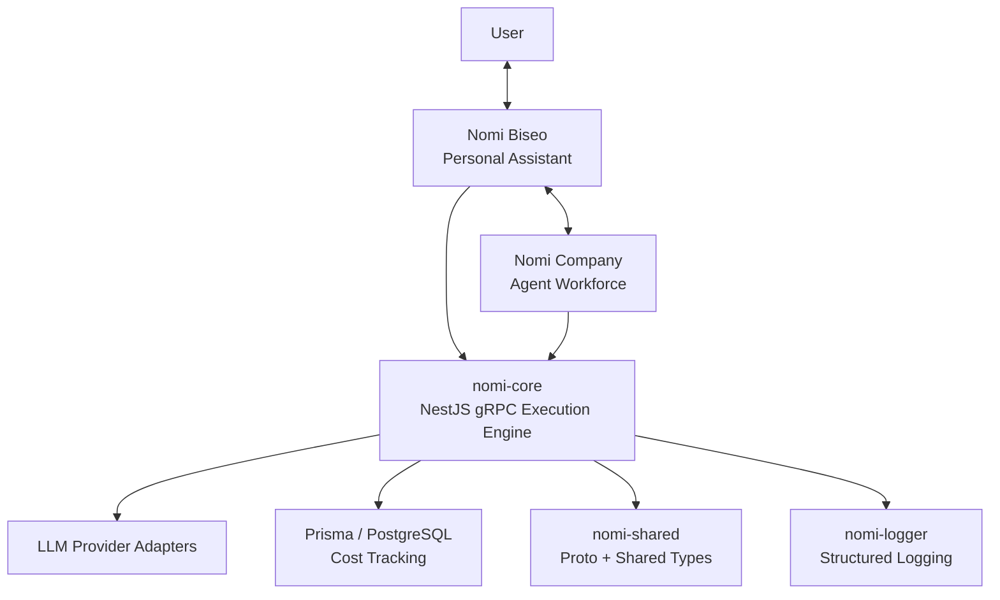

## Overview

Nomi AI System is a personal project aimed at building a long-lived AI ecosystem rather than a single chat interface. The core idea is to separate the memory-driven personal assistant, the specialized worker agents, and the LLM execution infrastructure into distinct layers so the system can grow without collapsing into one tightly coupled application.

The public repository is intentionally a showcase snapshot rather than the full product. In the visible code, I focused on the execution foundation through `nomi-core`, `nomi-shared`, and `nomi-logger`. Those packages define how AI requests are executed, validated, traced, and measured, while the higher-level Biseo and Company layers sit above them as the user-facing and delegation-oriented architecture.

### At a Glance

- Period: 2026.03 - Present
- Product type: personal AI ecosystem for assistant-driven and agent-driven work
- Public snapshot scope: execution engine, shared contracts, and structured logging
- Core value: provider-agnostic execution, structured validation, observability, and clear architectural boundaries

## Problem

Most AI applications begin by wiring a model call directly into a user-facing feature. That works for demos, but it breaks down once the system needs memory, delegation, multiple task types, fallback behavior, and cost control. A personal AI system that is meant to understand a user and orchestrate specialized agents cannot treat execution infrastructure as an afterthought.

I wanted a structure where the assistant layer could focus on understanding the user, memory, and intent; where worker agents could remain specialized and stateless; and where the execution layer could remain responsible for provider integration, validation, retry behavior, and cost tracking. That meant solving for architecture and operating rules before expanding visible assistant features.

## My Role

I was directly responsible for:

- Designing the layered Nomi system architecture
- Building `nomi-core` as a NestJS gRPC AI execution engine
- Implementing provider adapters plus retry and fallback handling
- Designing Zod-based structured output validation flow
- Designing Prisma and PostgreSQL-backed cost tracking
- Defining shared protobuf contracts and common types in `nomi-shared`
- Standardizing structured logging in `nomi-logger`

The work centered on making the execution foundation reusable and operationally defensible rather than building one isolated assistant feature.

## Architecture

Nomi Biseo is the personal assistant layer and the only direct user interface in the architecture. It is intended to use memory to interpret requests, decide whether work is simple or multi-step, and delegate when necessary. Nomi Company represents the specialized workforce layer: stateless agents for research, news, data handling, writing, and coding tasks.

Beneath both sits `nomi-core`, the execution engine. It receives gRPC requests, resolves the correct provider adapter, applies retry and fallback logic, validates structured outputs when needed, and records cost information. `nomi-shared` defines the shared protobuf contract and common types, while `nomi-logger` provides a standardized structured logging model across services.

## Key Decisions

### Splitting the system by responsibility instead of by feature

The common failure mode in AI projects is feature-first coupling: user interaction, orchestration, and execution policies end up in one code path. I separated Nomi into interaction, workforce, and execution layers so the assistant logic could evolve without dragging provider mechanics and runtime policies with it.

### Centralizing model access through `nomi-core`

If every assistant feature or agent integrates its own model SDK, the platform becomes inconsistent in how it retries, validates, records cost, and handles failures. I routed all execution through `nomi-core` so those concerns would stay centralized behind a gRPC contract.

### Treating reliability and cost as part of execution, not add-ons

AI systems fail in ways that are operationally expensive: malformed outputs, transient provider errors, and untracked spend. I designed the engine so validation, retry, fallback, and cost recording were default behaviors of execution rather than optional follow-up work by product features.

### Standardizing contracts and observability across services

Shared types and logging formats tend to drift unless they are explicitly owned. I pulled protobuf contracts and common types into `nomi-shared`, and logging into `nomi-logger`, so the ecosystem would have one execution contract and one observability model across services.

## Challenges

### Building infrastructure before the visible product felt complete

It is harder to justify engine work early because the most visible features arrive later. But postponing execution design usually leads to duplicated provider code, inconsistent retries, and weak observability. I chose to stabilize the runtime model first so the higher layers could be added on a stronger base.

### Making provider abstraction operationally meaningful

An adapter interface alone is not enough. The system also needs one consistent place for retry rules, fallback behavior, validation, and cost measurement. I solved that by pairing provider adapters with a central execution service instead of letting individual callers own their own policies.

### Preserving a clean boundary between memory-driven assistance and worker agents

The personal assistant layer and the worker-agent layer solve different problems. One manages context and user intent; the other performs specialized tasks. I kept those responsibilities distinct so the system can scale toward multi-agent execution without turning the assistant into an all-in-one monolith.

### Ensuring every request is traceable

AI behavior is hard to improve if requests cannot be correlated across logs, features, and costs. I standardized trace metadata and structured logging so each execution can be tracked by user, feature, and trace rather than only by whether it succeeded.

## Impact

- Designed a layered AI system that separates assistant, agent workforce, and execution concerns
- Built `nomi-core` to centralize model execution behind a NestJS gRPC service
- Added engine-level validation, retry, fallback, and cost recording as standard execution behavior
- Standardized protobuf contracts, shared types, and structured logging through reusable packages
- Created a provider-agnostic foundation for a memory-driven assistant and future multi-agent expansion
