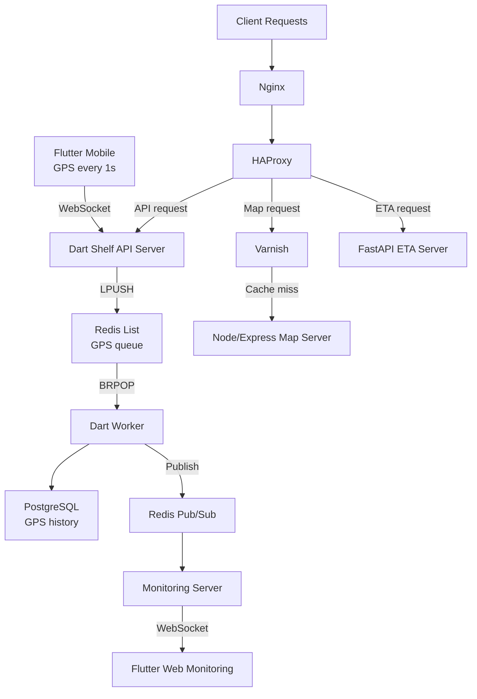

## Overview

Built at Fatos across 2022–2025, this platform tracked vehicle fleets in real time. Roughly 20-30 active devices reported GPS every second from the field. The mobile app transmitted location data, buffered it locally during connectivity loss, and replayed missed points after reconnect. A browser dashboard showed live vehicle positions, and the backend also generated downloadable driving reports such as driving score, driving data, and sudden-stop history.

The engineering challenge was not any single hard problem. It was the combination: a constant ingest stream that could not afford to stall, delayed telemetry arriving after reconnect, live monitoring that needed to stay fresh, and GeoJSON-heavy payloads that were too expensive to move around as plain JSON. I owned the full platform within a three-person team: client code, API design, database schema, proxy rules, cache behavior, CI/CD, and cross-service contracts.

Source code cannot be shared. This case study focuses on architecture and design decisions.

## Problem

**GPS arrives every second and cannot wait.** Roughly 20-30 active devices sent location updates at a fixed 1-second interval. At that frequency, any latency introduced inside the websocket handler compounds quickly across the whole fleet. The ingest server had to receive and hand off data, not process, persist, or fan out inline.

**Connectivity in the field is unreliable.** Devices could go offline or lose connection temporarily. The mobile app therefore had to keep GPS in local storage and replay it later, and the backend had to distinguish delayed backfill from fresh live movement instead of treating everything as if it arrived in perfect order.

**The same telemetry powers live monitoring and historical outputs.** GPS data had to end up in PostgreSQL as authoritative history, reach the browser dashboard as fast as possible, and support downloadable reports such as driving score, driving data, and sudden-stop history. The obvious approach — write to the database, then make every consumer read from there — directly ties dashboard freshness and reporting latency to the same storage path.

**Three traffic types, one infrastructure.** Realtime API, ETA calculations, and map/report requests behaved so differently that treating them identically at the application or proxy layer would cause them to interfere with each other. Map responses are cacheable and large. Realtime frames are tiny and continuous. ETA logic is CPU-bound. Mixing them without routing discipline means a slow day on one path becomes a slow day everywhere.

## My Role

Within a three-person team — me, one frontend engineer, the CTO — I designed and built:

- The main Dart Shelf API server and its Redis ingest pipeline
- Dart workers for queue consumption, database writes, and Pub/Sub publishing
- The FastAPI ETA service and the Node.js map/report service, later refactored from Express toward NestJS
- PostgreSQL schema design
- Nginx, HAProxy, and Varnish configuration
- Jenkins CI/CD and Azure infrastructure setup
- The WebSocket path in the Flutter mobile app, including offline GPS buffering and replay after reconnect
- The GPS data receiving path in the Flutter web dashboard
- Downloadable report generation for driving score, driving data, sudden-stop data, and related telemetry exports

In practice, I was responsible for the system as a coherent product flow, not just a backend service.

## Architecture

GPS leaves the phone every second over WebSocket using Protobuf plus Gzip to keep GeoJSON-heavy payloads smaller. If connectivity drops, the mobile app stores GPS locally and replays the backlog after reconnect. The Dart Shelf server receives each frame, immediately queues it in Redis with LPUSH, and does nothing else. Dart workers pull from that queue with BRPOP, write to PostgreSQL, and publish to Redis Pub/Sub in the same processing step. The monitoring server subscribes and pushes to the Flutter web dashboard.

The HTTP path runs separately. Nginx receives requests, HAProxy routes them by type, and traffic splits from there. Map requests hit Varnish first — cache hits return immediately, misses continue to the Node.js map service. ETA requests go to FastAPI. Report download requests are served from the Node.js reporting surface backed by persisted driving data. Everything else reaches the Dart server.

The separation matters because these two paths have nothing in common operationally. One is a continuous stream of small, high-frequency writes where latency compounds fast. The other is a mix of CPU-bound computation and large, infrequently-changing responses. Routing them into the same surface would make each one harder to understand and tune.

## Key Decisions

### Keeping the websocket server out of the write path

The most straightforward design has the ingest server write GPS to PostgreSQL and push to the monitoring server before acknowledging. That works fine at low volume. At a 1-second reporting interval with a real fleet, write latency and monitoring fan-out latency both become your ingest latency — directly.

I made the Dart server a handoff point instead. Receive the frame, LPUSH to Redis, done. Workers handle everything else with BRPOP. This added components, but it created a meaningful fault boundary: database slowdowns and monitoring subscriber load can no longer pull down GPS reception. The ingest server's job became simple enough that it rarely has bad days.

### Running separate services and refactoring the Node.js surface as it grew

Combining realtime ingest, ETA logic, reporting, and map serving into one backend was an option. Deployment would have been simpler. I chose against it because the failure modes and scaling characteristics are genuinely different.

A websocket server under continuous GPS load behaves differently from a FastAPI service doing route calculations. Map and report serving are shaped by cache hit rates, file generation, and query patterns rather than by the same realtime constraints. The Node.js service started in Express and was later refactored toward NestJS as the surface area became broader and needed more structure. Keeping these workloads separate made each component's behavior independently observable and tunable.

### Putting cache logic in the infrastructure layer, not the application

Map tiles are cacheable. I could have implemented caching inside the Node/Express server. I put it in Varnish instead, sitting behind HAProxy.

The advantage is explicitness. Cache policy is visible at the infrastructure layer without reading application code. When cache behavior is surprising, HAProxy and Varnish logs are where you look first. The map server never processes a cache hit — it stays simple. The cache boundary stays clear and is not tangled with application logic.

### Protobuf serialization and Gzip for communication payloads

Location and GeoJSON-heavy payloads were exchanged continuously across the platform. JSON is convenient, but at a 1-second reporting interval it carries far more bytes than the data itself requires and adds avoidable parse overhead.

I standardized those communication paths around Protocol Buffers with Gzip compression. The combined effect reduced network transfer volume by approximately 60% compared to the JSON baseline. For a system that depends on keeping both mobile uplink and the ingest pipeline lightweight, shrinking each payload reduced pressure on the websocket handler, Redis, and downstream consumers throughout the chain.

## Challenges

### The ingest path cannot have bad days

A 1-second interval is unforgiving. If the ingest server slows down — because it is waiting on the database, because a downstream subscriber is backed up, because a worker is lagging — that latency compounds across every active device, immediately.

The solution was architectural. Moving work out of the websocket handler and into Redis-backed workers made the handler's job trivially simple: accept bytes, push to queue. That job does not slow down unless Redis itself has a problem, which is a much narrower failure surface than "everything that happens after receiving GPS."

### Live and durable, without coupling them

The dashboard needed to feel live. The database needed authoritative records. These are easy to satisfy independently; the tension appears when you try to satisfy both from one code path.

The resolution was to never route live updates through the database read path. Workers write to PostgreSQL and publish to Pub/Sub in the same step. The monitoring server subscribes to Pub/Sub, not to database queries. The dashboard stays close to real time; the database accumulates a clean history. Neither path has to wait for the other.

### Offline buffering and replay after reconnect

Field connectivity was not reliable enough to assume a permanent connection. When a device went offline, the mobile app stored GPS locally and sent the backlog once the connection recovered. That created a second class of traffic: delayed telemetry that was still valid but no longer "live" in the same sense as newly captured points.

I treated replay as part of the normal pipeline instead of as an edge case. That meant the backend could accept delayed updates, persist them correctly, and keep the monitoring flow from confusing backfilled data with fresh movement. The outcome was simple: GPS data captured during connection loss was not discarded.

### Maintaining coherence as the primary cross-stack owner

The hardest operational challenge was keeping contracts consistent across Flutter, Dart, Python, Node, PostgreSQL, and the proxy stack inside a three-person team where I owned most of the cross-stack integration. A WebSocket message format change, a schema migration, a HAProxy rule update, or a report export change each had to propagate consistently across the entire chain.

This is the kind of work that does not fit neatly into a task list. It is the judgment required to keep a multi-stack system understandable when there is no large team to catch drift.

## Impact

Operating the platform at Fatos from 2022 to 2025:

- Sustained a realtime GPS pipeline for roughly 20-30 concurrently active devices reporting every second
- Established a clean flow from mobile ingest to live browser monitoring, with Redis as the explicit handoff layer between them
- Handled offline buffering and replay so GPS captured during connection loss could be sent after reconnect instead of being dropped
- Applied Protobuf serialization and Gzip compression across communication paths carrying GeoJSON-heavy payloads, cutting network transfer volume by ~60% and improving end-to-end response latency
- Delivered downloadable driving reports including driving score, driving data, and sudden-stop history from persisted telemetry
- Built and operated backend services, database design, proxy configuration, Jenkins CI/CD, and Azure infrastructure as one integrated system

## What I Would Improve Next

Three things I would focus on if the system continued evolving:

**Observability.** Queue depth, worker lag, websocket connection health, and per-route cache hit rates should be continuously visible. Right now, capacity decisions rely more on inference than measurement.

**Fault handling around the queue path.** If a worker fails mid-processing, the current design has limited explicit behavior. A retry policy, dead-letter queue, and documented replay procedure would make the system more defensible in production.

**Cross-runtime deployment safety.** Changes that span Dart, Python, Node, and Flutter are manageable but require care. Better contract validation and more automated deployment coordination would reduce the risk of inconsistent rollouts.
