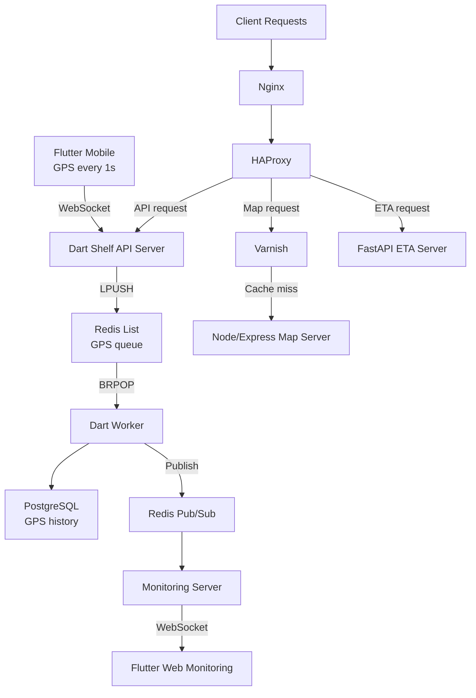

## Overview

This case study covers a real-time mobility tracking platform built at Fatos. The source code cannot be shared, so the focus here is on architecture, workflow design, and operational ownership rather than implementation details.

The system was broader than a backend service. It included a Flutter mobile client sending GPS updates every second, a Flutter web monitoring interface receiving live vehicle movement, multiple backend services for ingest, ETA, and map workloads, a Redis-backed realtime pipeline, PostgreSQL persistence, and Azure-based delivery infrastructure. The project was delivered by a three-person team: me, one frontend engineer, and the CTO. My contribution spanned the cross-stack workflow and most of the platform architecture and implementation.

## Problem

The core problem was coordinating three different needs in one product flow.

**High-frequency ingest.** Mobile devices sent GPS updates every second. That meant the websocket entry server needed to accept and hand off data quickly instead of doing heavy processing inline.

**Dual output paths.** The same GPS stream needed to become durable history in PostgreSQL and live movement in the monitoring web app.

**Uneven request profiles.** Realtime API traffic, ETA logic, and map requests had different behavior patterns, so they should not all be treated identically at either the application or proxy layer.

## Constraints

The system also had practical delivery constraints.

- The realtime ingest path had to stay simple enough to absorb continuous mobile updates without coupling directly to database write latency.
- Map requests were cacheable and operationally different from websocket and business-logic traffic, so routing needed to reflect that difference.
- The project was operated in Azure, which meant proxy, cache, and deployment behavior had to be repeatable rather than manually coordinated.
- Because I was working across frontend, backend, database, and infrastructure, interface boundaries had to stay explicit enough to be maintained by one engineer across multiple stacks.

## My Role

This was not a backend-only role. Within a three-person team made up of me, one frontend engineer, and the CTO, I planned and developed the API services, designed the PostgreSQL schema, set up and configured Nginx, HAProxy, Varnish, Jenkins, and Azure infrastructure, and handled the delivery process end to end. I also implemented the websocket communication path in the Flutter mobile app and the GPS-data receiving path in the Flutter web monitoring app.

In practical terms, I owned the system as a product workflow rather than as a single service: client communication, backend boundaries, persistence design, traffic routing, cache behavior, and deployment automation.

## Architecture

The realtime path is intentionally decoupled. The Dart Shelf server accepts websocket GPS frames from the mobile app and immediately pushes them into Redis. Dart workers consume that queue, persist records to PostgreSQL, and publish live updates through Redis Pub/Sub. A monitoring server subscribes to those updates and pushes them to the Flutter web dashboard over WebSocket.

The HTTP path is also explicit. Nginx fronts the system, HAProxy applies routing logic, map requests are checked by Varnish first, and only cache misses reach the Node/Express map server. ETA requests go to FastAPI, while other API traffic continues to the Dart server. This split keeps realtime ingest, business logic, and cacheable map traffic from collapsing into one operational surface.

## Key Decisions

### Redis queue between websocket ingest and database writes

The websocket entrypoint should acknowledge and hand off data, not become the place where persistence and live fan-out compete for time. I therefore made the Dart server write incoming GPS frames into Redis Lists with LPUSH and left database work to consumers using BRPOP.

That design increased moving parts, but it gave the system a better failure boundary. Database latency or live monitoring load no longer had to slow down the websocket handler directly.

### Separate services for ingest, ETA, and maps

I used different runtimes for different jobs: Dart Shelf for the main API and realtime ingest path, FastAPI for ETA-specific logic, and Node/Express for the map server. That was a deliberate boundary choice, not accidental heterogeneity.

The alternative would have been pushing multiple workloads into one server and one deployment surface. I rejected that because realtime sockets, ETA computation, and map-serving behavior fail differently and scale differently.

### Infrastructure-level map caching and routing

Map traffic deserved its own routing and caching policy. I put that logic in Nginx, HAProxy, and Varnish rather than embedding it inside the API server. HAProxy identified the request type, Varnish returned cache hits immediately, and Node/Express handled only the misses.

That kept the cache boundary explicit, reduced unnecessary load on the map server, and let the realtime API remain focused on its own path.

## Alternatives Considered

I avoided designs that looked simpler at first but produced a blurrier operational boundary.

- Writing directly from the websocket server to PostgreSQL would have reduced components, but it would also have coupled ingest stability to storage latency.
- Handling map caching inside the API layer would have mixed cache policy with business logic and made proxy behavior harder to reason about.
- Combining ETA, map, and realtime processing into one server would have simplified the service list but made ownership boundaries and operational tuning worse.

## Challenges and Solutions

### Keeping the realtime ingest path lightweight

At a 1-second reporting interval, the most important rule was not to turn the websocket server into a bottleneck. The solution was architectural rather than algorithmic: accept the frame, enqueue it, and let separate consumers perform persistence and live publishing.

That made the ingest path easier to keep stable and made worker behavior independently tunable when storage or downstream consumers needed attention.

### Aligning live monitoring with durable storage

The system needed both a durable history in PostgreSQL and an immediate live feed to the monitoring interface. I used worker-side persistence plus Redis Pub/Sub so the monitoring server could react to new updates quickly without reading them back from the database first.

That separation kept the browser dashboard close to realtime while preserving a clean authoritative write path for stored GPS history.

### Owning cross-stack integration

Because I was responsible for parts of the Flutter mobile app, Flutter web app, API services, database, proxies, cache layer, CI/CD, and Azure setup inside a small three-person team, the real challenge was maintaining clean contracts between layers. WebSocket formats, Redis usage, database schema assumptions, HAProxy rules, Varnish behavior, and Jenkins deployment steps all had to stay consistent.

That is the part of the project that most clearly reflects senior ownership: not just writing one service, but making the system understandable and operable across the full delivery chain.

## Reliability and Operations Notes

This project mattered because it established an operating model, not just a set of services.

- Redis created an explicit handoff between realtime ingest and downstream processing.
- HAProxy and Varnish made routing and cache policy observable at the infrastructure layer instead of implicit in application code.
- Jenkins gave the platform a repeatable deployment path across the services and proxy layers.
- Azure infrastructure, proxy settings, and service boundaries were configured as one system rather than as separate ad hoc servers.

## Impact

Observed across delivery and operation at Fatos (2022–2025):

- Realtime GPS flow: established from mobile websocket ingest to browser-based live monitoring
- System boundaries: ingest, persistence, live fan-out, ETA logic, and map serving were separated into explicit responsibilities
- Traffic handling: cacheable map requests were isolated behind Varnish and the Node/Express map server rather than burdening the main API path
- Delivery ownership: backend services, database design, infrastructure routing, Jenkins CI/CD, and Azure setup were built and operated as one system
- Cross-stack execution: mobile, web, backend, and operational layers were designed to work as one coherent product workflow

## What I Would Improve Next

If I extended this system further, I would focus on three things.

- Add stronger observability around queue depth, worker lag, websocket connection health, and per-route cache behavior so capacity decisions become measurement-driven.
- Introduce more formal failure-handling around the Redis queue path, such as retry policy, dead-letter handling, and clearer replay operations.
- Tighten service contracts and deployment automation further so cross-runtime changes across Dart, Python, Node, and Flutter are safer to evolve together.
