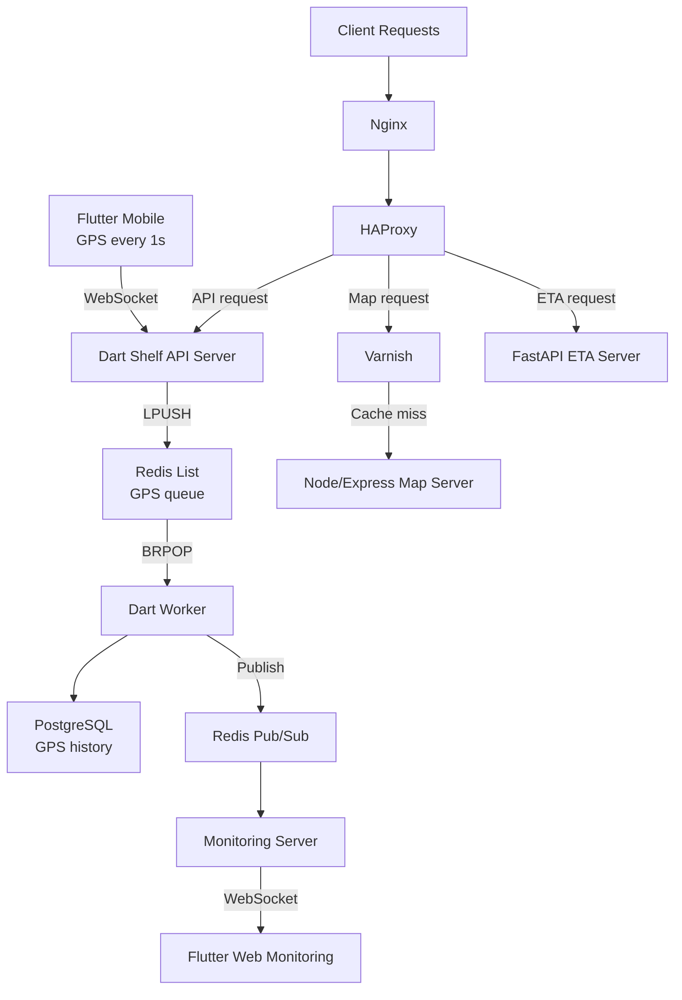

## Overview

Built at Fatos across 2022–2025, this platform tracked vehicle fleets in real time. A Flutter mobile app reported GPS every second. A browser-based dashboard showed live vehicle positions. Multiple backend services, a Redis pipeline, PostgreSQL, and a proxy/cache stack wired it all together in Azure.

The engineering challenge was not any single hard problem — it was the combination. Ingest that could not afford to be slow. A live feed and a durable history that needed to coexist without coupling. Three fundamentally different traffic profiles — streaming writes, CPU-bound computation, cacheable tile requests — sharing one infrastructure. I owned the full platform within a three-person team: client code, API design, database schema, proxy rules, cache behavior, CI/CD.

Source code cannot be shared. This case study focuses on architecture and design decisions.

## Problem

**GPS arrives every second and cannot wait.** Mobile devices sent location updates at a fixed 1-second interval. At that frequency, any latency introduced inside the websocket handler compounds immediately across every active device. The ingest server had to receive and hand off data — not process, persist, or fan out inline.

**The same data needs to go two places simultaneously.** Every GPS frame had to end up in PostgreSQL as authoritative history and reach a live browser dashboard as fast as possible. The obvious approach — write to the database, then push to monitoring — directly ties dashboard latency to database write latency. That was not acceptable.

**Three traffic types, one infrastructure.** Realtime API, ETA calculations, and map tile requests behaved so differently that treating them identically at the application or proxy layer would cause them to interfere with each other. Map tiles are cacheable and large. Websocket frames are tiny and continuous. ETA logic is CPU-bound. Mixing them without routing discipline means a slow day on one path becomes a slow day everywhere.

## My Role

Within a three-person team — me, one frontend engineer, the CTO — I designed and built:

- The main Dart Shelf API server and its Redis ingest pipeline
- Dart workers for queue consumption, database writes, and Pub/Sub publishing
- The FastAPI ETA service and the Node/Express map server
- PostgreSQL schema design
- Nginx, HAProxy, and Varnish configuration
- Jenkins CI/CD and Azure infrastructure setup
- The WebSocket path in the Flutter mobile app
- The GPS data receiving path in the Flutter web dashboard

In practice, I was responsible for the system as a coherent product flow, not just a backend service.

## Architecture

GPS leaves the phone every second over WebSocket. The Dart Shelf server receives the frame, immediately queues it in Redis with LPUSH, and does nothing else. Dart workers pull from that queue with BRPOP, write to PostgreSQL, and publish to Redis Pub/Sub in the same processing step. The monitoring server subscribes and pushes to the Flutter web dashboard.

The HTTP path runs separately. Nginx receives requests, HAProxy routes them by type, and traffic splits from there. Map requests hit Varnish first — cache hits return immediately, misses continue to Node/Express. ETA requests go to FastAPI. Everything else reaches the Dart server.

The separation matters because these two paths have nothing in common operationally. One is a continuous stream of small, high-frequency writes where latency compounds fast. The other is a mix of CPU-bound computation and large, infrequently-changing responses. Routing them into the same surface would make each one harder to understand and tune.

## Key Decisions

### Keeping the websocket server out of the write path

The most straightforward design has the ingest server write GPS to PostgreSQL and push to the monitoring server before acknowledging. That works fine at low volume. At a 1-second reporting interval with a real fleet, write latency and monitoring fan-out latency both become your ingest latency — directly.

I made the Dart server a handoff point instead. Receive the frame, LPUSH to Redis, done. Workers handle everything else with BRPOP. This added components, but it created a meaningful fault boundary: database slowdowns and monitoring subscriber load can no longer pull down GPS reception. The ingest server's job became simple enough that it rarely has bad days.

### Running three separate services instead of one

Combining realtime ingest, ETA logic, and map serving into one backend was an option. Deployment would have been simpler. I chose against it because the failure modes and scaling characteristics are genuinely different.

A websocket server under continuous GPS load behaves differently from a FastAPI service doing route calculations. Map serving is dominated by cache hit rates, not CPU or I/O in the usual sense. Running them together means any one workload can degrade the others in ways that are hard to isolate during an incident. Separate services made each component's behavior independently observable and tunable.

### Putting cache logic in the infrastructure layer, not the application

Map tiles are cacheable. I could have implemented caching inside the Node/Express server. I put it in Varnish instead, sitting behind HAProxy.

The advantage is explicitness. Cache policy is visible at the infrastructure layer without reading application code. When cache behavior is surprising, HAProxy and Varnish logs are where you look first. The map server never processes a cache hit — it stays simple. The cache boundary stays clear and is not tangled with application logic.

## Challenges

### The ingest path cannot have bad days

A 1-second interval is unforgiving. If the ingest server slows down — because it is waiting on the database, because a downstream subscriber is backed up, because a worker is lagging — that latency compounds across every active device, immediately.

The solution was architectural. Moving work out of the websocket handler and into Redis-backed workers made the handler's job trivially simple: accept bytes, push to queue. That job does not slow down unless Redis itself has a problem, which is a much narrower failure surface than "everything that happens after receiving GPS."

### Live and durable, without coupling them

The dashboard needed to feel live. The database needed authoritative records. These are easy to satisfy independently; the tension appears when you try to satisfy both from one code path.

The resolution was to never route live updates through the database read path. Workers write to PostgreSQL and publish to Pub/Sub in the same step. The monitoring server subscribes to Pub/Sub, not to database queries. The dashboard stays close to real time; the database accumulates a clean history. Neither path has to wait for the other.

### Maintaining coherence across six technology layers alone

The hardest operational challenge was keeping contracts consistent across Flutter, Dart, Python, Node, PostgreSQL, and the proxy stack — inside a three-person team where I owned most of it. A WebSocket message format change, a schema migration, a HAProxy rule update: each had to propagate consistently across the entire chain.

This is the kind of work that does not fit neatly into a task list. It is the judgment required to keep a multi-stack system understandable when there is no large team to catch drift.

## Impact

Operating the platform at Fatos from 2022 to 2025:

- Established a clean GPS pipeline from mobile ingest to live browser monitoring, with Redis as the explicit handoff layer between them
- Separated five distinct concerns — ingest, persistence, live fan-out, ETA logic, map serving — into services with clear operational boundaries
- Isolated cacheable map traffic behind Varnish and Node/Express, keeping the main API path unaffected by map load
- Owned backend services, database design, proxy configuration, Jenkins CI/CD, and Azure infrastructure as one integrated system
- Delivered the platform as a coherent product workflow: mobile, web, backend, and operations designed together from the start

## What I Would Improve Next

Three things I would focus on if the system continued evolving:

**Observability.** Queue depth, worker lag, websocket connection health, and per-route cache hit rates should be continuously visible. Right now, capacity decisions rely more on inference than measurement.

**Fault handling around the queue path.** If a worker fails mid-processing, the current design has limited explicit behavior. A retry policy, dead-letter queue, and documented replay procedure would make the system more defensible in production.

**Cross-runtime deployment safety.** Changes that span Dart, Python, Node, and Flutter are manageable but require care. Better contract validation and more automated deployment coordination would reduce the risk of inconsistent rollouts.
