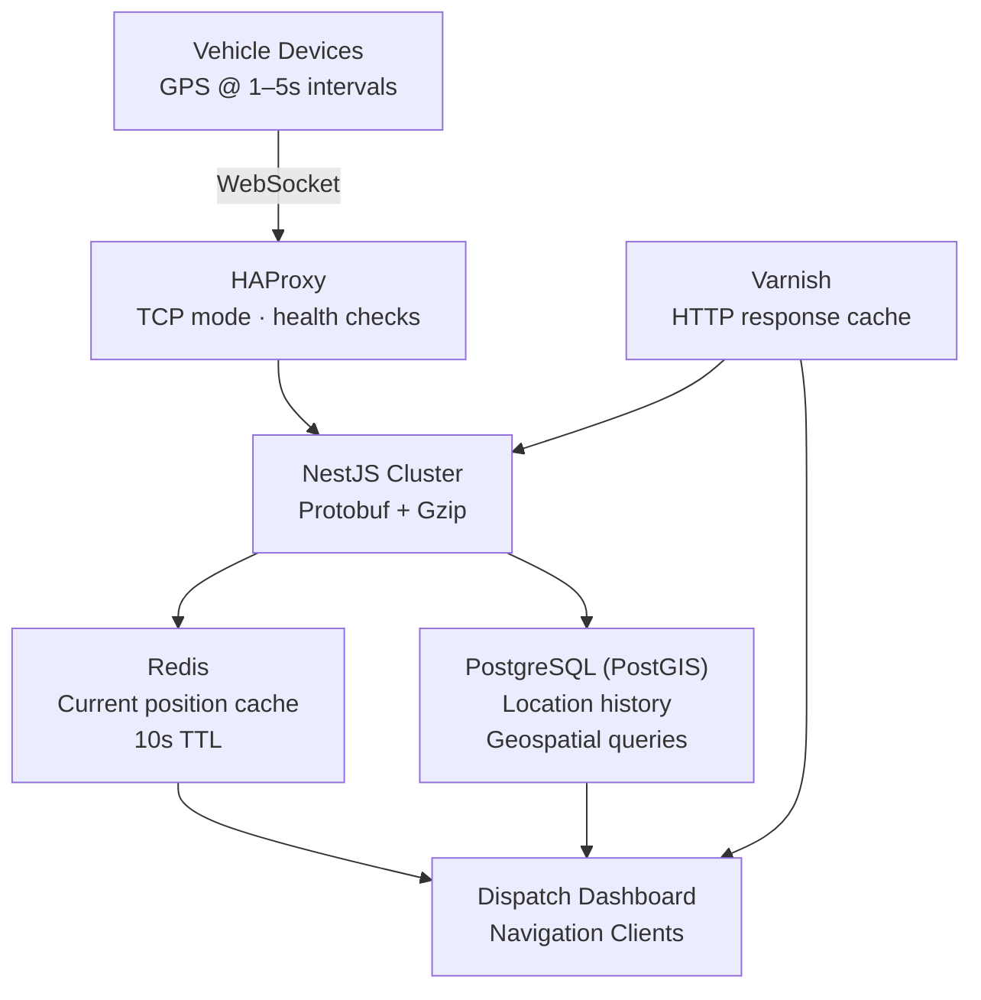

## Overview

This project covers the backend and infrastructure work behind a B2B fleet management platform operated at Fatos — a system that streams real-time GPS data from vehicle devices to fleet operators, dispatchers, and navigation clients simultaneously.

The core engineering challenges were network efficiency at scale, geospatial query performance, and service availability under fleet growth. Over the project lifecycle I owned the streaming pipeline, database layer, and infrastructure end-to-end, operating across GCP, Azure, and on-premise environments.

## Problem

Fleet vehicles report GPS position every 1–5 seconds. Those updates fan out to multiple connected clients — dispatcher dashboards, navigation interfaces, analytics pipelines. As the fleet grew, three structural problems compounded each other.

**Network cost.** All payloads were raw JSON. The bandwidth overhead was tolerable at small fleet sizes but grew proportionally with vehicle count until it became a real operational cost.

**Database pressure.** PostGIS geospatial queries ran on every request with no cache in front. Repeated proximity lookups — "show all vehicles within 500m of this location" — executed the same queries against the database on every poll.

**Single point of failure.** The backend was a single NestJS process handling all WebSocket connections. During peak dispatch hours, this process was both the throughput ceiling and the only failure point.

## My Role

Senior backend engineer with end-to-end ownership across the streaming pipeline, database layer, and infrastructure. I designed and implemented the Protobuf serialization layer, the Redis caching strategy, the HAProxy load balancing configuration, and the Varnish caching setup. I also operated the multi-cloud deployment throughout the project lifecycle.

## Architecture

Vehicle devices maintain persistent WebSocket connections through HAProxy to a pool of NestJS servers. Incoming position updates are written to PostGIS for durable storage and simultaneously update the Redis current-position cache. Client-facing HTTP endpoints (route data, zone boundaries, historical queries) pass through Varnish before reaching the application layer.

## Key Decisions

### Protobuf over JSON

The decision came from measurement. Sampling real traffic showed GPS update messages averaged 340 bytes as JSON. The equivalent Protobuf schema encoded to roughly 60 bytes — an 82% reduction per message. With Gzip layered on top, total daily transfer volume dropped by approximately 60%.

The tradeoff was debugging complexity. Binary frames are not human-readable in standard log output. We added a `x-encoding: json` development-mode header that returned plain JSON when set, keeping local debugging ergonomics acceptable.

### Redis caching strategy

Analysis of query patterns showed that reads were dominated by current-position lookups — the same vehicle queried repeatedly in a short window. A 10-second TTL Redis cache in front of PostGIS absorbed most of this traffic while keeping position data fresh enough for dispatch use cases.

We chose shared Redis over per-node in-memory caches. Per-node caches are faster but lose their state on node restarts and return inconsistent data in a multi-node setup. Redis as a shared cache is simpler to reason about and easier to monitor.

### HAProxy TCP-mode load balancing

WebSocket connections are long-lived and upgrade from HTTP. HTTP-mode proxies can interrupt idle connections, which drops sessions. TCP-mode HAProxy passes WebSocket traffic transparently while still providing health-check-based routing. We set up a dedicated health endpoint on each node and configured HAProxy to remove unhealthy nodes within 10 seconds of failure, enabling clean rolling deployments.

## Challenges and Solutions

### GeoJSON response bottleneck

Route geometry and zone boundary endpoints returned GeoJSON payloads that could reach several hundred kilobytes for complex routes. Clients experienced noticeable rendering delays.

Profiling the response path revealed two bottlenecks: PostGIS was serializing geometry to GeoJSON synchronously on the main event loop, and Gzip compression was applied after the full response string was assembled in memory. Moving geometry serialization to a worker pool removed the event loop block. Switching to streaming Gzip — compressing chunks as they were assembled rather than the final string — reduced both response time and peak memory usage on this code path.

### Rolling Protobuf migration

A hard cutover requiring all clients to update simultaneously was not operationally acceptable. We negotiated encoding format at connection establishment: clients set a `x-encoding: protobuf` header during the WebSocket upgrade handshake, and the server handled both JSON and Protobuf connections throughout the migration window.

Schema changes were restricted to additive-only additions until the migration was complete. After all clients had moved to Protobuf, deprecated fields were marked reserved and removed in a follow-up schema version.

## Impact

Measured across production operation at Fatos (2022–2025):

- Network transfer volume: **~60% reduction** after Protobuf + Gzip rollout
- PostGIS query pressure: significantly reduced through Redis current-position caching
- Service availability: improved from single-node fragility to HAProxy-distributed multi-node setup
- GeoJSON endpoints: response time improved after streaming Gzip and worker pool restructuring
- Infrastructure: operated across **GCP, Azure, and on-premise** environments simultaneously
