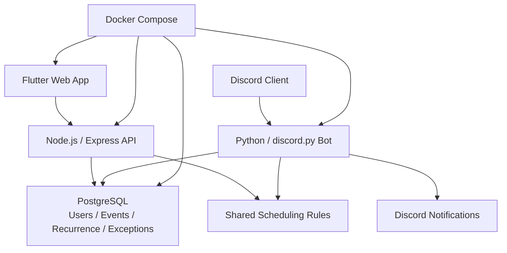

## 개요

CalBot은 2025년 11월부터 12월까지 진행한 개인 프로젝트로, 웹 기반 캘린더와 Discord 봇 인터페이스를 하나의 일정 시스템으로 연결한 스케줄링 애플리케이션입니다. 목표는 단순히 달력을 보여주는 웹앱을 만드는 것이 아니라, 브라우저와 Discord처럼 사용 맥락이 다른 두 채널에서 같은 일정 데이터를 일관되게 다룰 수 있게 하는 것이었습니다.

저는 Flutter Web으로 캘린더 UI를 만들고, Node.js와 Express로 일정 CRUD API를 구성했으며, Python과 discord.py로 Discord 봇 서버를 분리했습니다. 또한 PostgreSQL 기반 데이터 모델, 반복 일정 규칙, 예외 회차 처리, 알림 흐름, Docker Compose 실행 구성을 정리해 단순 데모가 아니라 실제로 확장 가능한 형태의 개인 프로젝트로 만들었습니다.

### 한눈에 보기

- 기간: 2025.11 - 2025.12
- 성격: 웹 캘린더와 Discord 봇을 통합한 개인 일정 관리 프로젝트
- 담당 범위: 프론트엔드, API, Discord 봇, 데이터 모델, 컨테이너 실행 구조 전반
- 핵심 가치: 다중 인터페이스 일관성, 반복 일정 모델링, 제품 완성도, 재현 가능한 개발 환경

## 문제

이 프로젝트의 핵심 문제는 캘린더를 그리는 일이 아니라, 여러 인터페이스가 같은 일정 모델을 정확하게 공유하게 만드는 데 있었습니다. 웹에서는 월간 캘린더와 폼 기반 편집이 자연스럽지만, Discord에서는 짧은 명령과 자연어 입력으로 일정을 다뤄야 합니다. 입력 방식은 달라도 결과적으로는 같은 일정이 생성되고 수정되어야 했습니다.

또한 실제 일정 관리에서 중요한 것은 단순한 CRUD를 넘는 세부 규칙입니다. 반복 일정은 매일 또는 매주 수준에서 끝나지 않고, 특정 요일 반복, 월간 규칙, 종료 조건, 특정 회차 예외 처리 같은 요구가 함께 등장합니다. 여기에 개별 회차 완료 상태까지 지원하려면 데이터 모델을 처음부터 더 정교하게 잡아야 했습니다.

결국 핵심 질문은 이것이었습니다. 어떻게 하면 웹 UI와 Discord 봇이 서로 다른 경험을 제공하면서도 일정 데이터와 동작 규칙은 하나로 유지할 수 있을까, 그리고 반복 일정의 현실적인 복잡도를 감당하는 구조를 어떻게 단순하게 유지할 수 있을까.

## 역할

제가 직접 맡은 범위는 다음과 같습니다.

- Flutter Web 기반 캘린더 및 일정 관리 UI 설계 및 구현
- GetX 기반 상태 관리, 라우팅, 설정 흐름 정리
- Node.js 및 Express 기반 일정 CRUD API 설계 및 구현
- Python 및 discord.py 기반 Discord 봇 서버 구성
- PostgreSQL 일정, 사용자, 반복 규칙, 예외 처리 데이터 모델 설계
- Discord 명령 및 자연어 기반 일정 생성 흐름 설계
- Docker Compose 기반 다중 서비스 실행 환경 구성
- 반복 일정 예외 처리와 개별 완료 상태 관리 로직 설계

개별 화면이나 개별 서버가 아니라, 일정 도메인 전체를 여러 실행 표면에 걸쳐 설계하고 구현하는 역할이었습니다.

## 아키텍처

Flutter Web은 월간 캘린더, 아젠다, 일정 생성 및 설정 인터페이스를 제공합니다. Node.js와 Express API는 일정 CRUD, 검증, 사용자 데이터 접근을 담당합니다. Python 봇 서버는 Discord 명령과 자연어 입력을 해석해 일정 생성 및 조회 흐름으로 연결하고, 알림 메시지를 전송합니다. PostgreSQL은 일정, 반복 규칙, 예외 날짜, 사용자 설정, Discord 서버 구성을 저장하는 권위 저장소로 사용했습니다.

이 구조의 핵심은 웹과 Discord가 따로 놀지 않도록 하는 것이었습니다. 두 인터페이스는 서로 다른 UX를 가지지만, 일정 규칙과 저장 모델은 공유해야 했습니다. Docker Compose는 이 다중 서비스 구성을 실행 가능한 단위로 고정해, 개발과 배포 준비 흐름을 단순하게 유지하는 역할을 했습니다.

## 핵심 결정

### 웹과 Discord를 같은 일정 모델 위에 올리기

브라우저 UI와 Discord 봇을 별도 제품처럼 만들면 각 채널이 빠르게 분리됩니다. 저는 먼저 일정 도메인을 정의하고, 웹과 봇은 이를 소비하는 각기 다른 인터페이스로 위치시키는 방향을 택했습니다.

이 결정 덕분에 일정 생성 규칙, 반복 처리, 예외 데이터, 완료 상태가 한쪽에서만 다르게 동작하는 문제를 줄일 수 있었습니다.

### 반복 일정을 데이터 모델 문제로 다루기

반복 일정은 UI에서 옵션 몇 개를 제공한다고 해결되지 않습니다. 중요한 것은 저장 형식과 해석 규칙입니다. 저는 반복 규칙을 RFC 5545 호환 형태로 관리하고, 예외 날짜와 완료 이력을 별도 데이터로 다뤄 시리즈 전체와 개별 회차를 함께 표현할 수 있게 했습니다.

이렇게 하면 특정 회차 삭제, 일부 회차 완료 처리 같은 현실적인 요구를 더 자연스럽게 다룰 수 있습니다.

### Discord 봇을 알림 부속물이 아니라 일정 인터페이스로 설계

Discord 봇은 보통 알림만 보내는 부가 기능으로 끝나는 경우가 많지만, 이 프로젝트에서는 실제 일정 생성과 조회의 진입점이어야 했습니다. 그래서 명령형 입력과 자연어 입력을 모두 일정 생성 요청으로 수렴시키는 방향으로 설계했습니다.

그 결과 사용자는 웹을 열지 않아도 Discord 안에서 기본 일정 작업을 수행할 수 있고, 데이터는 동일한 모델에 쌓이도록 유지할 수 있었습니다.

### 다중 서비스 구조를 Docker Compose로 고정

여러 런타임을 쓰는 프로젝트는 서비스별 실행 방법이 조금씩 달라지는 순간 유지비가 급격히 늘어납니다. 저는 프론트엔드, API, 봇, 데이터베이스를 컨테이너 기준으로 정리하고 Compose 파일로 연결해, 실행 순서와 의존 관계를 명확히 했습니다.

이는 개인 프로젝트에서도 환경 재현성과 배포 준비도를 높이는 데 의미가 있었습니다.

## 도전과 해결

### 반복 일정의 예외 처리와 회차별 상태 관리

반복 일정은 단순히 같은 이벤트를 여러 번 보여주는 문제가 아닙니다. 특정 날짜만 취소하거나, 일부 회차만 완료 처리하는 기능이 필요하면 기본 모델이 금방 무너집니다.

저는 반복 규칙, 예외 날짜, 완료 회차를 분리해 저장함으로써 시리즈 전체 규칙과 개별 인스턴스 상태를 함께 유지할 수 있게 했습니다.

### 서로 다른 입력 경험을 같은 규칙으로 연결

웹에서는 폼과 캘린더 상호작용이 자연스럽지만, Discord에서는 짧은 메시지와 명령어가 중심입니다. 두 경험을 억지로 같게 만들 수는 없었지만, 검증과 저장 규칙은 같아야 했습니다.

그래서 입력 해석은 각 인터페이스에 맞게 두고, 일정 모델과 저장 경로는 공통화하는 방향으로 구조를 잡았습니다.

### 제품 완성도를 좌우하는 세부 UX 정리

일정 앱은 작은 디테일이 누적돼 사용성을 만듭니다. 올데이 일정, 색상 선택, 메모와 장소, 모바일 대응, 완료 상태 표시, 기본값 자동 채움 같은 요소가 빠지면 기능이 있어도 매끄럽게 느껴지지 않습니다.

저는 핵심 기능 외에도 폼 흐름, 시각적 상태, 테마 설정까지 함께 정리해 실제 사용 가능한 수준의 경험을 만드는 데 집중했습니다.

## 성과

- Flutter Web, Node.js API, Python Discord 봇을 결합한 개인 일정 관리 시스템 설계 및 구현
- RFC 5545 호환 반복 일정과 예외 날짜, 개별 완료 회차 추적 지원
- 웹 UI와 Discord 인터페이스에서 동일한 일정 규칙과 저장 모델 유지
- Docker Compose 기반으로 프론트엔드, API, 봇, PostgreSQL 실행 구성을 재현 가능하게 정리
- 일정 생성, 조회, 수정, 알림 흐름을 하나의 도메인 모델로 통합
- 개인 프로젝트임에도 다중 서비스 경계와 확장 가능성을 고려한 구조 확보
