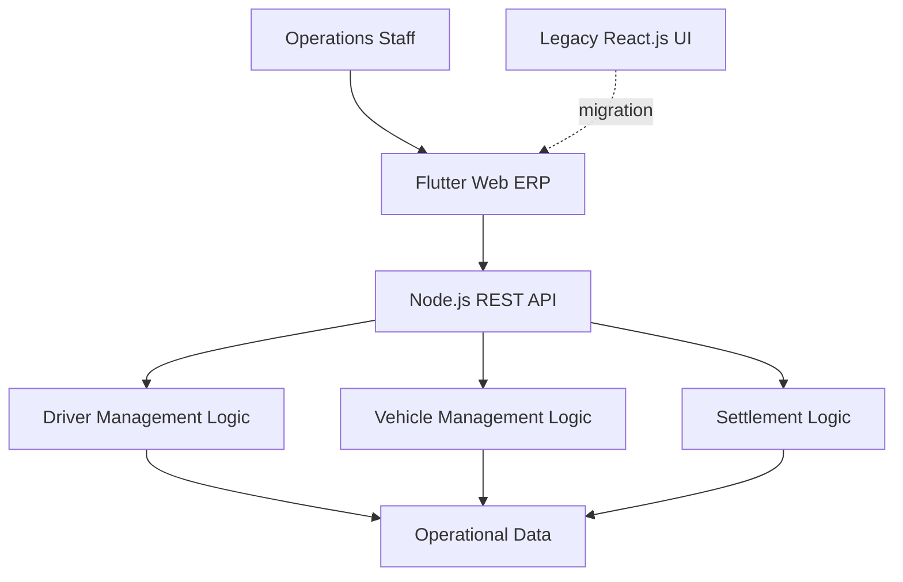

## 개요

법인택시회사의 전사관리 플랫폼을 2022년 초부터 약 5개월 동안 개선한 프로젝트입니다. 기존 React.js 기반 운영 서비스를 Flutter Web으로 마이그레이션하면서 프론트엔드 구조를 다시 정리했고, 동시에 Node.js 기반 REST API와 핵심 비즈니스 로직을 설계 및 구현했습니다.

이 프로젝트의 핵심은 단순히 기술 스택을 교체하는 것이 아니었습니다. 기사, 차량, 정산처럼 운영 흐름이 연결된 도메인을 안정적으로 다루려면 화면 구조와 API 계약, 그리고 데이터 흐름이 함께 정리되어야 했습니다. 저는 프론트엔드 마이그레이션과 백엔드 구조 개선을 하나의 문제로 보고 접근했습니다.

소스 코드는 공개할 수 없으며, 이 문서는 구조 개선과 설계 판단에 집중합니다.

### 한눈에 보기

- 기간: 2022.01 - 2022.05
- 제품 성격: 법인택시회사 운영용 ERP
- 담당 범위: Flutter Web 마이그레이션, Node.js REST API 설계, 비즈니스 로직 구현
- 핵심 도메인: 기사 관리, 차량 관리, 정산 관리

## 문제

기존 운영 서비스는 React.js 기반으로 동작하고 있었지만, 기능이 늘어나면서 화면 구조와 상태 흐름이 점점 복잡해지고 있었습니다. 특히 기사, 차량, 정산은 별도 메뉴처럼 보이지만 실제로는 서로 연결된 업무 흐름이기 때문에, 한 화면의 변경이 다른 기능과 API에 영향을 주기 쉬운 상태였습니다.

문제는 UI만의 문제가 아니었습니다. 운영 화면과 백엔드 API 사이 계약이 충분히 구조화되어 있지 않으면, 프론트엔드는 화면별 예외 처리와 임시 변환 로직을 늘리게 되고, 백엔드는 비즈니스 규칙보다 화면 요구사항에 끌려다니게 됩니다. 결과적으로 새 기능을 추가하거나 기존 흐름을 수정할 때 영향 범위를 예측하기 어려워집니다.

따라서 이 프로젝트는 React.js 화면을 Flutter Web으로 바꾸는 작업에 그치지 않았습니다. 프론트엔드 구조를 개선하면서, 동시에 Node.js REST API 설계와 데이터 흐름까지 다시 정리해 운영 기능을 더 예측 가능하게 만드는 것이 목표였습니다.

## 역할

제가 직접 맡은 범위는 다음과 같습니다.

- React.js 기반 운영 서비스를 Flutter Web 구조로 마이그레이션
- Node.js 기반 REST API 설계
- 기사, 차량, 정산 관리의 핵심 비즈니스 로직 구현
- 프론트엔드와 백엔드 사이 API 명세 정리
- 화면 단위 데이터 흐름 점검 및 최적화

즉, 프론트엔드 프레임워크 전환과 서버 도메인 로직 정리를 함께 진행한 역할이었습니다.

## 아키텍처

운영 사용자는 Flutter Web 기반 ERP 화면에서 기사, 차량, 정산 기능을 사용합니다. 프론트엔드는 화면과 상태를 도메인별로 정리하고, 백엔드는 Node.js REST API를 통해 각 도메인의 규칙과 처리 흐름을 담당합니다. 핵심은 화면이 직접 비즈니스 규칙을 품지 않도록 하고, API가 도메인 기준으로 동작하도록 경계를 분리하는 것이었습니다.

이 구조는 두 가지 목적을 가졌습니다. 첫째, React.js 기반 기존 화면에서 Flutter Web으로 옮기는 동안 프론트엔드 구조를 더 단순하게 만드는 것. 둘째, 운영 화면이 필요로 하는 데이터를 API 계약 기준으로 정리해 이후 기능 변경 시 영향 범위를 줄이는 것이었습니다.

## 핵심 결정

### 마이그레이션을 구조 개선 기회로 사용

프레임워크 전환은 자칫 기존 복잡성을 다른 기술 위로 그대로 옮기는 작업이 될 수 있습니다. 저는 Flutter Web 전환을 단순 이식이 아니라, 화면 구조와 상태 흐름을 다시 정리하는 계기로 삼았습니다. 그 결과 이후 기능 확장 시 화면별 책임을 더 선명하게 유지할 수 있었습니다.

### API를 화면 기준이 아닌 도메인 기준으로 정리

기사, 차량, 정산은 각각 독립된 메뉴이면서도 운영 규칙상 서로 연결되어 있습니다. 이 관계를 화면 단위 임시 API로 처리하면 규칙이 흩어집니다. 그래서 REST API를 화면별 편의 엔드포인트보다 도메인 경계 중심으로 설계해, 비즈니스 로직이 서버에 일관되게 남도록 했습니다.

### API 명세를 명시적 계약으로 관리

운영 제품은 입력 항목과 상태 전이가 많기 때문에, 프론트엔드와 백엔드가 암묵적으로 맞춘 계약은 오래 버티지 못합니다. 요청과 응답 형태를 먼저 정리해 명세를 기준 계약으로 사용했고, 이를 토대로 화면과 서버가 같은 모델을 바라보도록 했습니다.

### 데이터 흐름 최적화로 화면 복잡도 제어

관리 화면은 목록, 상세, 수정, 상태 변경이 반복되므로, 필요한 데이터보다 많거나 적게 주고받으면 곧바로 복잡성이 커집니다. 각 기능이 실제로 필요한 조회와 갱신 흐름을 기준으로 API와 화면 상태를 정리해, 중복 데이터 전달과 불필요한 결합을 줄였습니다.

## 도전과 해결

### 기존 운영 기능을 흔들지 않는 마이그레이션

ERP는 업무 현장에서 바로 사용되기 때문에, 구조 개선이 운영 리스크가 되어서는 안 됐습니다. 그래서 핵심 도메인인 기사, 차량, 정산을 기준으로 화면과 API를 함께 정리하며 마이그레이션 범위를 통제했습니다. 이 방식은 기능 회귀 가능성을 낮추면서도 구조 개선을 실제 제품에 반영하는 데 유리했습니다.

### 얽힌 비즈니스 규칙을 화면 밖으로 끌어내기

운영 규칙을 프론트엔드 화면에 남겨두면 비슷한 검증과 계산이 여러 곳에 반복됩니다. 저는 핵심 비즈니스 로직을 Node.js REST API로 모아, 화면은 사용자 입력과 결과 표현에 집중하도록 역할을 나눴습니다. 그 결과 규칙 변경 시 수정 지점이 더 명확해졌습니다.

### 프론트엔드와 백엔드 간 데이터 흐름 단순화

목록, 상세, 수정, 상태 변경이 잦은 ERP에서는 데이터 구조가 조금만 불명확해도 화면 상태가 빠르게 복잡해집니다. 요청과 응답에 포함되는 정보를 재점검해 중복 전달을 줄이고, 각 화면이 필요한 계약만 소비하도록 정리했습니다. 이 조정은 기능 추가 시 프론트엔드와 백엔드가 서로의 내부 구현에 덜 의존하게 만드는 데 도움이 됐습니다.

## 성과

- React.js 기반 운영 서비스를 Flutter Web으로 마이그레이션하며 프론트엔드 구조를 개선
- Node.js 기반 REST API를 설계하고 핵심 비즈니스 로직을 구현
- 기사 관리, 차량 관리, 정산 관리 기능을 중심으로 ERP 운영 흐름 구축
- API 명세를 명확히 정의해 프론트엔드와 백엔드의 협업 기준 정리
- 데이터 흐름을 최적화해 화면 상태 관리와 기능 확장 시 복잡도 완화
