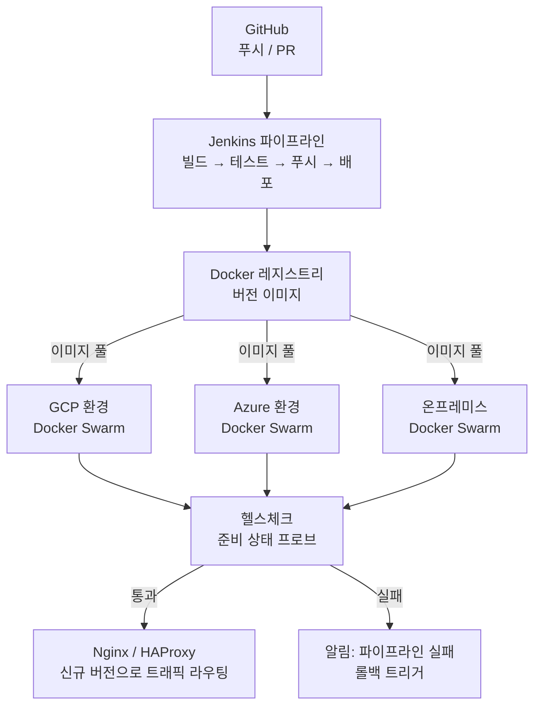

## 개요

Fatos에서 운영한 B2B 모빌리티 플랫폼의 인프라 자동화 및 배포 파이프라인 구축 사례입니다. 환경별 수작업 스크립트와 구성 드리프트에서 시작해, Docker 컨테이너화와 Jenkins CI/CD 파이프라인으로 세 개 클라우드 환경에 걸쳐 일관되고 빠르며 검증 가능한 배포 체계를 구축했습니다.

## 문제

플랫폼은 세 개의 독립된 인프라 환경에서 운영되었습니다: GCP, Azure, 온프레미스 서버. 각 환경은 역사적으로 자체 배포 스크립트, 도구 버전, 구성 패턴을 가지고 있었습니다. 서비스 업데이트를 배포하려면 대상 환경의 절차를 수작업으로 따라가고, 팀원 간 타이밍을 조율하며, 상태를 수동으로 확인해야 했습니다.

두 가지 구조적 문제가 시간이 지날수록 심화되었습니다.

**공유 배포 아티팩트 없음.** 각 서비스는 환경별 셸 스크립트로 소스 코드를 풀하고 프로세스를 재시작하는 방식으로 배포되었습니다. 환경 간 소스 드리프트가 프로덕션에서만 재현되는 버그의 반복적인 원인이었습니다.

**배포 후 자동 검증 없음.** 스크립트가 종료 코드 0으로 완료되면 배포가 완료된 것으로 간주했고, 실제 서비스 상태는 확인하지 않았습니다.

## 역할

인프라, 컨테이너화, CI/CD 파이프라인 설계를 전담했습니다. Dockerfile 및 Docker Compose 작성, 서비스별 Jenkinsfile 구축, Docker Swarm 오케스트레이션 구성, Nginx 및 HAProxy 설정, 헬스체크 및 알림 메커니즘 구현을 모두 직접 수행했습니다.

## 아키텍처

각 서비스는 버전 이미지를 생성하는 Dockerfile을 갖습니다. Jenkins가 GitHub에서 코드를 가져와 빌드 및 테스트 후 레지스트리에 이미지를 푸시하고, 대상 환경에 배포를 오케스트레이션합니다. Docker Swarm이 환경 내에서 롤링 업데이트를 처리하고, 배포 후 헬스체크가 서비스 준비 상태를 확인합니다.

## 핵심 결정

### Docker Swarm vs. Kubernetes

Kubernetes는 오토스케일링, 세밀한 네트워크 정책 등 더 많은 기능을 제공하지만 컨트롤 플레인 운영 자체에 상당한 운영 부담이 따릅니다. Docker Swarm은 서비스 레벨 오케스트레이션, 롤링 업데이트, 헬스체크 기반 재시작을 전담 DevOps 없이도 백엔드 엔지니어가 운영할 수 있는 복잡도로 제공합니다. 트레이드오프는 스케줄러 기능과 에코시스템이었고, 현재 팀 규모와 요구사항에서는 수용 가능했습니다.

### 컨테이너화를 배포 계약으로

이전에는 각 서비스가 서버에서 직접 소스를 풀하고 재시작하는 방식으로 배포되었습니다. 시스템 패키지, 라이브러리 버전, 설정 파일이 환경마다 독립적으로 변화하면서 환경 드리프트가 필연적으로 발생했습니다. Docker 이미지를 배포 아티팩트로 사용하면 CI에서 검증한 것과 정확히 같은 런타임이 모든 환경에 배포됩니다. 환경별 값은 런타임 환경 변수로 주입하여 이미지 자체는 환경에 독립적으로 유지했습니다.

### 헬스체크를 파이프라인 게이트로

배포가 성공해도 서비스가 실제로는 비정상일 수 있습니다. 없는 환경 변수, 잘못된 DB 연결 문자열, 시작 시 경쟁 조건이 그 예입니다. Jenkins 배포 스테이지에 헬스 엔드포인트 프로브를 추가하여 서비스가 정상 상태를 반환할 때만 다음 스테이지로 진행하도록 변경했습니다. 이전에는 프로덕션에서 발견되던 장애가 파이프라인 스테이지에서 감지되기 시작했습니다.

## 도전과 해결

### 세 환경에 걸친 배포 일관성

GCP, Azure, 온프레미스는 서로 다른 네트워크 구성과 방화벽 규칙을 가지고 있었으며, 각 환경의 배포 스크립트가 독립적으로 발전해 있었습니다. Jenkins 공유 라이브러리를 사용해 환경별 배포 명령을 공통 인터페이스 뒤로 추상화했습니다. 환경 값은 Jenkins 크리덴셜로 저장하고 배포 시점에 주입했습니다. 이 변경으로 세 개의 환경별 스크립트가 하나의 파이프라인과 환경 파라미터로 통합되었습니다.

### 시작 시점 장애 감지

Node.js 서비스가 프로세스는 정상 기동했지만 실제로는 잘못 구성된 경우가 있었습니다. 데이터베이스 연결이 지연 초기화되어 첫 요청 시에만 실패하거나, 특정 코드 경로에서만 접근하는 환경 변수가 없는 경우가 그 예입니다. 프로세스가 실행 중이므로 단순한 프로세스 확인은 정상을 반환했습니다.

각 서비스에 `GET /health` 엔드포인트를 구현했습니다. 이 엔드포인트는 시작 시 DB 연결, 필수 환경 변수, 외부 의존성을 동기적으로 검증합니다. Jenkins 배포 스테이지는 이 엔드포인트가 200을 반환할 때까지 대기하고, 설정한 준비 상태 시간 내에 정상이 되지 않으면 파이프라인을 실패시킵니다. 이전에는 프로덕션에서 발견되던 장애가 파이프라인 스테이지에서 감지되기 시작했습니다.

## 성과

Fatos 운영 기간(2022–2025) 동안의 결과입니다:

- 서비스당 배포 시간: CI/CD 자동화 후 **약 70% 단축**
- 배포 일관성: 환경별 스크립트 분기 제거, Docker 기반 단일 파이프라인으로 통일
- 프로덕션 배포 오류: 파이프라인 레벨 헬스체크로 조기 감지 체계 구축
- **GCP, Azure, 온프레미스** 세 환경에서 통일된 배포 도구 운영
- 헬스체크 및 알림 체계 도입으로 장애 대응 시간 개선
