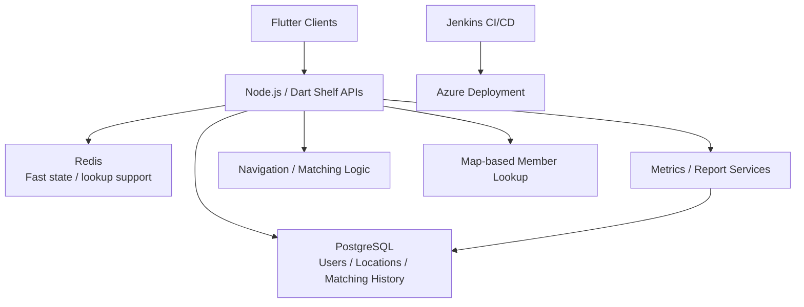

## 개요

Fatos에서 2022년 6월부터 2023년 12월까지 진행한 지도 기반 멤버 관리 및 매칭, 내비게이션 시스템입니다. 이 프로젝트의 핵심은 하나의 제품을 단독으로 개발하는 것이 아니라, 서로 유사한 3개의 프로젝트를 공통 아키텍처 위로 정리해 재사용성과 확장성을 확보하는 데 있었습니다.

저는 Flutter, Node.js, Dart Shelf를 기반으로 클라이언트와 서버 구조를 설계하고, PostgreSQL 및 Redis를 활용한 사용자·위치·매칭 데이터 모델을 정리했습니다. 또한 Jenkins 기반 CI/CD와 Azure 운영 환경을 구축해 프로젝트 간 배포 방식을 표준화했고, 지도 기반 조회, 매칭, 내비게이션, 통계·리포트 기능까지 하나의 운영 가능한 시스템으로 통합했습니다.

소스 코드는 공개할 수 없으며, 이 문서는 구조와 설계 판단 중심으로 정리한 초안입니다.

### 한눈에 보기

- 기간: 2022.06 - 2023.12
- 성격: 3개 프로젝트를 공통 기반으로 묶은 지도 기반 멤버 관리 및 매칭 시스템
- 담당 범위: 시스템 설계, 백엔드, 데이터베이스, 배포 파이프라인, 운영 환경
- 핵심 가치: 공통화, 재사용성, 위치 기반 응답성, 운영 가시성

## 문제

이 프로젝트의 문제는 기능 하나를 구현하는 데 있지 않았습니다. 유사한 요구를 가진 프로젝트가 여러 개 존재했고, 각각을 별도 코드베이스와 별도 운영 체계로 유지하면 기능 추가와 유지보수가 반복적으로 비싸지는 구조였습니다.

동시에 지도 기반 서비스 특성상 사용자 위치 조회, 멤버 탐색, 매칭, 내비게이션 같은 기능은 응답성이 중요했습니다. 반면 운영 측면에서는 서비스 지표, 통계, 리포트 같은 관리 기능도 필요했습니다. 즉, 사용자 경험과 운영 가시성을 동시에 고려한 구조가 필요했습니다.

핵심 질문은 명확했습니다. 어떻게 하면 프로젝트별 차이를 흡수하면서도 공통 기반을 유지할 것인가, 그리고 위치 기반 기능과 운영 기능을 같은 시스템 안에서 일관되게 유지할 것인가.

## 역할

제가 직접 맡은 범위는 다음과 같습니다.

- Flutter, Node.js, Dart Shelf 기반 시스템 구조 설계 및 개발
- PostgreSQL 및 Redis 기반 데이터 구조 설계와 성능 개선
- 위치 기반 서비스, 멤버 조회, 매칭, 내비게이션 기능 구현
- 서비스 지표 수집, 통계, 리포트 기능 구현
- Jenkins 기반 CI/CD 구축
- Azure 배포 및 운영 환경 설정
- 유사 프로젝트 간 공통 아키텍처와 재사용 가능한 구조 정리

단순히 기능 개발만 한 것이 아니라, 여러 프로젝트를 장기적으로 운영 가능한 제품군으로 정리하는 역할이었습니다.

## 아키텍처

Flutter 클라이언트는 지도 기반 UI, 멤버 조회, 매칭 요청, 내비게이션 흐름을 담당합니다. 백엔드는 Node.js와 Dart Shelf를 기반으로 사용자 상태, 위치 조회, 매칭 처리, 운영 통계 API를 제공합니다. PostgreSQL은 권위 있는 데이터 저장소로서 사용자, 멤버, 매칭 이력, 위치 관련 데이터를 저장하고, Redis는 빠른 조회와 상태 보조 계층으로 사용했습니다.

이 구조의 핵심은 프로젝트별 기능 차이를 흡수할 수 있도록 공통 도메인과 데이터 구조를 명확히 유지한 것입니다. 여기에 Jenkins와 Azure를 통해 배포와 운영 흐름까지 공통화해, 기능뿐 아니라 운영 방식도 재사용 가능하도록 만들었습니다.

## 핵심 결정

### 3개 프로젝트를 공통 아키텍처로 정리

프로젝트별로 비슷한 기능을 매번 별도로 개발하면 속도는 잠깐 빠를 수 있어도, 시간이 갈수록 유지보수 비용이 크게 늘어납니다. 그래서 저는 공통 도메인 모델과 API 패턴을 먼저 정리하고, 프로젝트별 차이는 설정과 조합 가능한 기능 단위로 흡수하는 방향을 택했습니다.

이 선택은 단순한 코드 재사용보다 더 중요했습니다. 새로운 프로젝트가 생기거나 요구가 바뀌더라도, 어디까지가 공통 영역이고 어디부터가 프로젝트별 확장인지 경계를 유지할 수 있었기 때문입니다.

### PostgreSQL과 Redis의 역할 분리

위치 기반 시스템에서는 데이터 정합성과 응답성을 동시에 잡아야 합니다. PostgreSQL은 장기 저장과 이력 관리에 적합하고, Redis는 즉시성이 중요한 상태 데이터 처리에 유리합니다.

저는 사용자, 위치, 매칭 이력은 PostgreSQL을 기준 저장소로 관리하고, 조회 속도가 중요한 일부 상태와 보조 데이터를 Redis에 두는 방식으로 역할을 나눴습니다. 이 구조는 성능 최적화가 필요할 때도 어디를 조정해야 하는지 명확하게 해주었습니다.

### 운영 지표와 리포트를 초기부터 포함

실무에서는 기능이 동작하는 것만으로는 부족합니다. 운영팀이나 고객이 실제로 보고 싶은 숫자와 리포트가 있어야 서비스 상태를 이해할 수 있습니다. 그래서 통계와 리포트 기능을 나중에 덧붙이는 부가 기능이 아니라, 초기부터 핵심 설계 범위 안에 넣었습니다.

그 결과 제품 기능과 운영 기능이 따로 놀지 않았고, 프로젝트별 성과와 사용 패턴을 비교할 수 있는 운영 기반도 함께 만들 수 있었습니다.

### 배포 체계 표준화

유사 프로젝트를 여러 개 운영하면서 배포 방식이 제각각이면 공통화의 장점이 빠르게 사라집니다. Jenkins 기반 CI/CD를 만들고 Azure 배포 절차를 표준화해, 프로젝트가 달라도 빌드와 릴리스 흐름은 같은 틀을 따르도록 했습니다.

이렇게 해두면 신규 기능 반영이나 운영 이슈 대응 시 프로젝트별 학습 비용이 줄고, 반복 작업도 크게 줄어듭니다.

## 도전과 해결

### 공통화와 프로젝트별 요구의 균형

세 프로젝트는 충분히 비슷했지만 완전히 같지는 않았습니다. 모든 것을 일반화하면 오히려 더 복잡해지고, 각 프로젝트별로 예외 처리를 늘리면 공통 아키텍처의 가치가 사라집니다.

그래서 공통 도메인과 데이터 구조는 강하게 유지하되, 차이가 필요한 지점만 조합 가능한 단위로 나누는 방식을 택했습니다. 이 접근으로 공통화의 이점을 유지하면서도 프로젝트별 요구를 수용할 수 있었습니다.

### 지도 기반 기능의 응답성 확보

사용자는 지도 화면에서 결과가 느리면 곧바로 품질 저하를 체감합니다. 멤버 조회, 위치 확인, 매칭, 내비게이션은 모두 응답성이 중요한 경로였습니다.

PostgreSQL과 Redis의 역할을 나누고 자주 접근하는 상태 데이터를 빠르게 다룰 수 있도록 구조를 정리해, 위치 기반 조회와 매칭 흐름의 체감 성능을 개선했습니다.

### 운영 기능을 제품 기능과 함께 유지

통계와 리포트는 종종 뒤로 밀리기 쉽지만, 실제 서비스 운영에서는 빠질 수 없는 기능입니다. 저는 이를 제품의 부속물이 아니라 운영을 위한 핵심 기능으로 보고, 데이터 수집과 리포트 생성을 처음부터 함께 설계했습니다.

이 결정 덕분에 서비스 성과를 수치로 확인하고, 프로젝트별 운영 상태를 비교할 수 있는 기반을 만들 수 있었습니다.

## 성과

- 지도 기반 멤버 관리, 위치 조회, 매칭, 내비게이션 기능을 포함한 3개 유사 프로젝트를 공통 구조로 통합
- Flutter, Node.js, Dart Shelf 기반 크로스플랫폼 아키텍처 설계 및 개발
- PostgreSQL과 Redis를 활용해 사용자·위치·매칭 데이터 모델을 정리하고 성능 최적화
- Jenkins 기반 CI/CD와 Azure 운영 환경을 구축해 반복 가능한 배포 체계 마련
- 서비스 지표 수집, 통계, 리포트 기능 구현으로 운영 가시성 확보
- 유사 프로젝트 재사용성과 장기 확장성을 개선하는 공통 기반 마련
