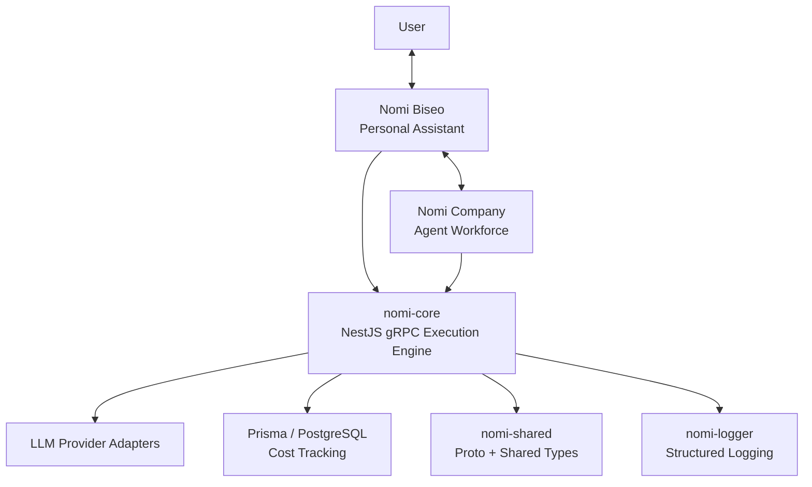

## 개요

Nomi AI System은 개인 AI 비서와 특화 에이전트 워크포스를 하나의 실행 인프라 위에서 동작시키기 위해 설계한 개인 프로젝트입니다. 목표는 단순한 챗 애플리케이션을 만드는 것이 아니라, 사용자를 이해하는 비서 계층, 작업을 수행하는 에이전트 계층, 그리고 LLM 호출을 안정적으로 실행하는 인프라 계층을 분리해 장기적으로 확장 가능한 AI 시스템을 만드는 데 있었습니다.

현재 공개된 저장소는 전체 시스템의 데모용 스냅샷이며, 실제 개발은 일부 비공개 저장소와 함께 진행 중입니다. 공개 범위 안에서는 `nomi-core`, `nomi-shared`, `nomi-logger`를 중심으로 실행 엔진, 공유 계약, 구조화 로깅 계층을 구현했고, Biseo와 Company는 이 위에서 동작하는 상위 구조로 설계했습니다.

### 한눈에 보기

- 기간: 2026.03 - 현재
- 성격: 개인화된 AI 비서와 멀티 에이전트 확장을 목표로 한 개인 AI 시스템
- 공개 스냅샷 범위: 실행 엔진, 공통 계약, 구조화 로깅
- 핵심 가치: provider-agnostic 실행, 검증 가능한 출력, 비용 추적, 멀티 계층 책임 분리

## 문제

개인용 AI 시스템이 실제 제품이 되려면 단순한 프롬프트 조합 이상이 필요합니다. 사용자의 맥락과 메모리를 활용하는 상위 비서 계층, 작업 유형별로 분리된 에이전트 계층, 그리고 모델 호출을 안전하게 실행하는 하위 인프라 계층이 서로 다른 책임을 가져야 합니다. 그렇지 않으면 사용자 경험, 작업 오케스트레이션, 모델 SDK 호출, 비용 집계, 실패 처리, 로깅이 모두 같은 코드 안에 섞이게 됩니다.

또한 이 시스템은 특정 LLM 제공자에 고정되어서는 안 됐습니다. 모델 품질, 가격, 장애 특성이 바뀔 수 있기 때문에 provider abstraction, retry, fallback, structured validation, cost tracking이 처음부터 설계에 포함돼야 했습니다. 저는 이 문제를 '어떻게 더 똑똑한 프롬프트를 만들까'보다 '어떻게 실패 가능성과 확장을 감당하는 실행 구조를 만들까'의 문제로 보았습니다.

## 역할

제가 직접 맡은 범위는 다음과 같습니다.

- Nomi의 계층형 시스템 구조 설계
- NestJS gRPC 기반 AI 실행 엔진 `nomi-core` 설계 및 구현
- LLM provider adapter 구조, 재시도 및 fallback 흐름 구현
- Zod 기반 구조화 출력 검증 흐름 설계
- Prisma/PostgreSQL 기반 비용 추적 구조 설계
- `nomi-shared`를 통한 protobuf 계약 및 공통 타입 정리
- `nomi-logger`를 통한 구조화 로깅 표준화

즉, 사용자 경험 그 자체보다 그 아래에서 모든 AI 요청을 안정적으로 실행하는 기반 시스템을 설계하고 구현하는 역할이 중심이었습니다.

## 아키텍처

상위 계층의 Nomi Biseo는 사용자와 직접 대화하는 개인 비서입니다. 메모리를 활용해 요청을 해석하고, 간단한 요청은 직접 처리하거나 더 복잡한 작업은 Nomi Company의 특화 에이전트에게 위임합니다. Nomi Company는 연구, 뉴스, 데이터 처리, 작성, 코딩 같은 역할별 에이전트 워크포스를 의미하며, 사용자와 직접 맞닿기보다 작업 실행에 집중합니다.

그 아래의 `nomi-core`는 모든 AI 호출을 처리하는 실행 엔진입니다. gRPC 요청을 받아 적절한 provider adapter를 선택하고, 필요하면 재시도와 fallback을 적용하며, 구조화 출력 검증과 비용 기록까지 수행합니다. `nomi-shared`는 서비스 간 공통 protobuf 계약과 타입을 제공하고, `nomi-logger`는 traceId, userId, featureId를 포함하는 구조화 로그를 모든 서비스에서 일관되게 남기도록 합니다.

## 핵심 결정

### 사용자 접점과 실행 엔진을 분리

개인 AI 제품에서 가장 흔한 문제는 비서 로직과 모델 호출 로직이 한곳에 섞이는 것입니다. 저는 Biseo를 사용자와 메모리 중심 계층으로 두고, LLM 호출과 운영 정책은 별도의 실행 엔진으로 분리했습니다.

이렇게 하면 나중에 새로운 에이전트나 기능이 추가되어도 상위 계층은 실행 세부사항을 몰라도 되고, 하위 계층은 비즈니스 판단 없이 재사용 가능합니다.

### 모든 AI 호출을 gRPC 실행 서비스로 통합

여러 기능이 직접 모델 SDK를 호출하기 시작하면 실패 정책과 비용 추적 규칙이 빠르게 중복됩니다. 그래서 `nomi-core`를 공통 gRPC 서비스로 두고, 상위 계층은 공통 proto 계약만 통해 요청하도록 설계했습니다.

이는 provider 전환, fallback, observability를 중앙에서 통제할 수 있게 해주었습니다.

### 검증과 비용 추적을 운영 이후의 관심사가 아니라 엔진 기본값으로 처리

AI 응답은 구조가 어긋나거나, 실패하거나, 비용이 예상보다 커질 수 있습니다. 이런 문제를 상위 기능이 개별적으로 해결하게 두면 시스템이 금방 불안정해집니다. 그래서 구조화 출력 검증, retry, fallback, cost record를 엔진 내부의 기본 책임으로 설계했습니다.

그 결과 상위 계층은 "무슨 작업을 시킬지"에 집중하고, 실행 품질은 공통 인프라가 책임지는 구조를 만들 수 있었습니다.

### 공유 계약과 로깅을 패키지로 분리

멀티 서비스 구조에서 공통 타입과 로그 포맷이 서비스마다 복제되면 유지보수가 빠르게 어려워집니다. `nomi-shared`에 proto 계약과 공통 타입을, `nomi-logger`에 구조화 로깅을 분리해 각 서비스가 같은 계약과 observability 기준을 따르도록 했습니다.

## 도전과 해결

### 기능보다 실행 구조를 먼저 세우기

대부분의 AI 프로젝트는 데모 기능을 먼저 만들고, 그 뒤에 retry나 logging을 덧붙입니다. 하지만 그렇게 하면 기능별로 인프라 품질이 달라집니다. 저는 오히려 공통 실행 엔진부터 설계해 이후의 기능과 에이전트가 동일한 실행 계약을 공유하도록 만들었습니다.

### Provider abstraction을 실제 운영 수준까지 밀어붙이기

인터페이스만 추상화하는 것으로는 충분하지 않습니다. provider마다 실패 양상과 비용 모델이 다르기 때문에, 재시도, fallback, 비용 기록까지 포함해 일관된 실행 정책을 가져야 합니다. 저는 adapter 패턴과 execution service를 결합해 이 운영 규칙을 공통화했습니다.

### 메모리 기반 비서와 stateless agent workforce의 경계 잡기

사용자와 오래 상호작용하는 비서와, 특정 작업을 수행하는 stateless agent는 같은 방식으로 설계할 수 없습니다. Biseo는 메모리와 의사결정에 집중하고, Company는 특화 작업 실행에 집중하는 구조로 경계를 잡아 이후 확장이 가능한 설계를 만들었습니다.

### 모든 실행에 대한 추적 가능성 확보

AI 요청은 결과만 보면 충분해 보이지만, 실제 개발과 운영에서는 어느 요청이 어떤 모델을 사용했고 비용이 얼마나 들었는지를 알아야 합니다. traceId, userId, featureId를 기준으로 로깅과 비용 기록을 연결해, 단순한 성공/실패를 넘어 실행 품질을 분석할 수 있는 기반을 마련했습니다.

## 성과

- 개인 비서, 에이전트 워크포스, 실행 엔진을 계층적으로 분리한 Nomi 시스템 아키텍처 설계
- NestJS gRPC 기반 `nomi-core`를 구축해 LLM 호출을 공통 서비스로 수렴
- 구조화 출력 검증, retry, fallback, 비용 기록을 실행 엔진 기본 책임으로 내장
- `nomi-shared`와 `nomi-logger`를 통해 공통 계약과 관측 가능성 계층을 표준화
- 향후 Biseo와 멀티 에이전트 확장을 감당할 수 있는 provider-agnostic 기반 확보
