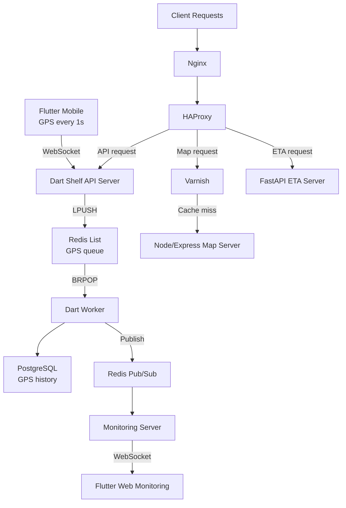

## 개요

Fatos에서 개발한 실시간 모빌리티 트래킹 플랫폼 사례입니다. 소스 코드는 공개할 수 없기 때문에, 여기서는 구현 세부 코드보다 아키텍처, 데이터 흐름, 운영 방식, 그리고 제가 맡은 범위를 중심으로 설명합니다.

이 프로젝트는 단순한 백엔드 기능 개발이 아니었습니다. Flutter 모바일 앱이 1초마다 GPS를 전송하고, Flutter Web 모니터링 화면은 이를 실시간으로 받아 차량 상태를 보여주며, 백엔드에는 수집 서버, ETA 서버, 지도 서버, Redis 기반 실시간 파이프라인, PostgreSQL 저장소, Azure 기반 인프라가 함께 동작했습니다. 프로젝트는 저, 프론트엔드 개발자 1명, CTO 1명으로 구성된 3인 팀이 진행했고, 저는 이 가운데 여러 계층을 가로지르는 핵심 흐름과 상당수의 아키텍처 및 구현을 맡았습니다.

## 문제

이 시스템의 핵심 과제는 서로 다른 성격의 요구를 하나의 제품 흐름 안에서 동시에 만족시키는 것이었습니다.

**고빈도 수집.** 모바일 앱은 1초마다 GPS를 전송했기 때문에 WebSocket 진입 서버는 무거운 처리를 직접 수행하기보다 빠르게 수신하고 넘겨주는 역할에 집중해야 했습니다.

**실시간과 이력의 동시 처리.** 동일한 GPS 데이터가 PostgreSQL에는 이력으로 저장되어야 했고, 동시에 웹 모니터링 화면에는 거의 실시간으로 반영되어야 했습니다.

**서로 다른 요청 특성.** 실시간 API, ETA 계산, 지도 요청은 부하와 캐시 전략이 다르기 때문에 애플리케이션과 프록시 계층 모두에서 동일하게 다루면 안 됐습니다.

## 제약 조건

구현과 운영에는 몇 가지 현실적인 제약도 있었습니다.

- 실시간 수집 경로는 지속적인 모바일 업데이트를 받아야 했기 때문에 데이터베이스 쓰기 지연과 직접 결합되지 않도록 단순하게 유지해야 했습니다.
- 지도 요청은 캐시 가능한 트래픽이었고 실시간 API와 운영 특성이 달랐기 때문에 별도의 라우팅 기준이 필요했습니다.
- 프로젝트는 Azure에서 운영됐으므로 프록시, 캐시, 배포 흐름이 수동 조정이 아닌 반복 가능한 형태로 관리되어야 했습니다.
- 저는 프론트엔드, 백엔드, 데이터베이스, 인프라에 걸쳐 작업했기 때문에 계층 간 인터페이스가 한 사람이 유지할 수 있을 정도로 명확해야 했습니다.

## 역할

이 프로젝트에서 제 역할은 백엔드에만 한정되지 않았습니다. 3인 팀 안에서 API 서버들을 기획하고 개발했으며, PostgreSQL 스키마를 설계하고, Nginx, HAProxy, Varnish, Jenkins, Azure 인프라를 직접 구성하고 운영했습니다. 또한 Flutter 모바일 앱의 WebSocket 통신 부분과 Flutter Web 모니터링 앱의 GPS 수신 부분도 구현했습니다.

실질적으로는 하나의 서비스가 아니라 하나의 제품 흐름을 맡은 셈이었습니다. 클라이언트 통신, 백엔드 경계 설정, 데이터 저장 구조, 트래픽 라우팅, 캐시 정책, 배포 자동화까지 모두 연결된 하나의 시스템으로 다뤘습니다.

## 아키텍처

실시간 경로는 의도적으로 분리되어 있습니다. Dart Shelf 서버는 모바일 앱에서 들어오는 GPS 프레임을 WebSocket으로 받아 곧바로 Redis에 넣습니다. Dart Worker는 이 큐를 소비하면서 PostgreSQL에 이력을 저장하고, 동시에 Redis Pub/Sub으로 실시간 이벤트를 발행합니다. 모니터링 서버는 이를 구독해 Flutter Web 대시보드에 WebSocket으로 전달합니다.

HTTP 경로도 명시적으로 나눴습니다. Nginx가 진입점을 맡고, HAProxy가 요청 성격에 따라 라우팅합니다. 지도 요청은 먼저 Varnish에서 캐시를 확인하고, 캐시 미스일 때만 Node/Express 지도 서버로 이동합니다. ETA 요청은 FastAPI로, 일반 API 요청은 Dart 서버로 전달됩니다. 이렇게 나눔으로써 실시간 수집, 비즈니스 로직, 지도 요청이 하나의 운영 경계로 뭉개지지 않도록 했습니다.

## 핵심 결정

### WebSocket 수집과 DB 저장 사이에 Redis 큐를 둔 이유

WebSocket 진입 서버는 데이터를 받아서 빠르게 넘겨주는 역할에 집중해야 했습니다. 저장과 실시간 전파까지 이 서버에서 모두 처리하면, 데이터베이스 지연이나 모니터링 부하가 수집 안정성에 직접 영향을 주게 됩니다. 그래서 Dart 서버는 GPS 데이터를 Redis List에 LPUSH하고, 저장과 후속 처리는 BRPOP으로 데이터를 가져가는 Worker에게 맡겼습니다.

이 구조는 컴포넌트 수를 늘리지만, 실패 경계를 더 선명하게 만들어줍니다. PostgreSQL 저장 지연이나 실시간 구독 부하가 WebSocket 수집 성능을 직접 끌어내리지 않게 할 수 있었습니다.

### 수집, ETA, 지도 서버를 하나로 합치지 않은 이유

실시간 수집과 메인 API는 Dart Shelf, ETA는 FastAPI, 지도는 Node/Express로 분리했습니다. 이것은 우연한 기술 혼합이 아니라 의도적인 경계 설계였습니다.

하나의 서버에 모든 기능을 넣으면 서비스 목록은 줄어들 수 있지만, WebSocket 수집, ETA 계산, 지도 응답은 부하 특성과 장애 패턴이 다르기 때문에 운영과 튜닝이 더 어려워집니다. 분리된 서비스는 각 책임을 더 명확하게 유지하게 해주었습니다.

### 지도 요청은 인프라 계층에서 캐시와 라우팅을 처리

지도 요청은 실시간 API와 성격이 달라 별도의 라우팅과 캐시 정책이 필요했습니다. 이 로직을 애플리케이션 안에 넣지 않고 Nginx, HAProxy, Varnish 계층에서 처리하도록 했습니다. HAProxy가 요청을 분기하고, Varnish가 캐시 히트를 즉시 응답하며, 캐시 미스만 Node/Express 지도 서버로 전달합니다.

이렇게 하면 캐시 경계가 명확해지고, 지도 요청이 실시간 API의 책임과 섞이지 않게 됩니다.

## 고려했던 대안

처음에는 단순해 보이지만 운영 경계를 흐리게 만드는 설계는 피했습니다.

- WebSocket 서버에서 바로 PostgreSQL에 저장하는 방식은 컴포넌트는 줄지만, 저장 지연이 곧 수집 안정성 문제로 이어질 수 있었습니다.
- 지도 캐시를 API 서버 내부에서 처리하는 방식은 캐시 정책과 비즈니스 로직을 섞어 프록시 동작을 이해하기 어렵게 만들 수 있었습니다.
- ETA, 지도, 실시간 수집을 하나의 서버로 합치는 방식은 서비스 수는 줄지만 운영 경계와 튜닝 포인트를 더 불명확하게 만들었습니다.

## 도전과 해결

### 1초 단위 수집 경로를 가볍게 유지

GPS가 1초마다 들어오는 구조에서는 WebSocket 서버가 병목이 되지 않는 것이 가장 중요했습니다. 해결 방식은 알고리즘 최적화보다 아키텍처 분리에 가까웠습니다. 프레임을 받아 큐에 넣고, 별도 소비자가 저장과 실시간 전파를 수행하도록 한 것입니다.

이렇게 해서 수집 서버는 더 안정적으로 유지할 수 있었고, 저장이나 후속 처리 쪽 병목은 Worker 단위에서 별도로 조정할 수 있게 됐습니다.

### 실시간 모니터링과 영속 저장을 동시에 만족

이 시스템은 PostgreSQL에 남는 이력 데이터와, 웹 모니터링 화면에 즉시 보여줄 실시간 데이터가 모두 필요했습니다. 그래서 Worker가 저장을 수행하는 동시에 Redis Pub/Sub으로 이벤트를 발행하게 했고, 모니터링 서버는 이를 구독해 별도 조회 없이 바로 브라우저로 전달하도록 했습니다.

그 결과 웹 대시보드는 거의 실시간에 가깝게 반응하면서도, 저장 경로는 권위 있는 이력 기록으로 깔끔하게 유지할 수 있었습니다.

### 여러 계층을 함께 맞추는 통합 작업

저는 Flutter 모바일 일부, Flutter Web 일부, API 서비스, 데이터베이스, 프록시, 캐시 계층, CI/CD, Azure 설정까지 폭넓게 맡았기 때문에, 실제 난제는 한 서비스의 구현보다 계층 간 계약을 일관되게 유지하는 것이었습니다. WebSocket 메시지 형식, Redis 사용 방식, 데이터베이스 스키마, HAProxy 규칙, Varnish 정책, Jenkins 배포 절차가 모두 서로 어긋나지 않아야 했습니다.

이 지점이 이 프로젝트에서 가장 시니어하게 드러나는 부분이기도 합니다. 단일 서비스 구현이 아니라, 여러 스택에 걸친 시스템 전체를 이해 가능하고 운영 가능하게 맞추는 일이었기 때문입니다.

## 운영 및 신뢰성 관점

이 프로젝트의 의미는 단순히 서비스를 몇 개 만든 것이 아니라, 운영 가능한 시스템 모델을 세운 데 있었습니다.

- Redis는 실시간 수집과 후속 처리 사이의 명확한 전달 지점을 만들었습니다.
- HAProxy와 Varnish는 라우팅과 캐시 정책을 애플리케이션 코드가 아니라 인프라 계층에서 관찰 가능하게 만들었습니다.
- Jenkins는 여러 서비스와 프록시 설정을 반복 가능한 배포 흐름으로 묶어주었습니다.
- Azure 인프라, 프록시 설정, 서비스 경계가 각각 따로 노는 서버들이 아니라 하나의 시스템으로 운영되도록 정리했습니다.

## 성과

Fatos에서 개발 및 운영하면서 확인한 결과는 다음과 같습니다.

- 모바일 WebSocket 수집부터 브라우저 기반 실시간 모니터링까지 이어지는 GPS 처리 흐름을 구축했습니다.
- 수집, 저장, 실시간 전파, ETA, 지도 응답을 각각 명확한 책임으로 분리해 시스템 경계를 선명하게 만들었습니다.
- 지도 요청은 Varnish와 Node/Express 뒤로 분리해 메인 API 경로에 불필요한 부하가 쌓이지 않도록 했습니다.
- API 서비스, 데이터베이스 설계, 인프라 라우팅, Jenkins CI/CD, Azure 운영을 하나의 체계로 구축했습니다.
- 모바일, 웹, 백엔드, 운영 요소가 하나의 제품 흐름으로 자연스럽게 이어지도록 정리했습니다.

## 다음에 더 개선할 점

이 시스템을 더 발전시킨다면 다음 세 가지에 집중할 것입니다.

- 큐 적체, Worker 지연, WebSocket 연결 상태, 요청별 캐시 동작을 더 정밀하게 관측해 확장 판단을 감이 아니라 데이터 기반으로 전환
- Redis 큐 경로에 대해 재시도 정책, dead-letter 처리, 재처리 절차를 더 공식화해 장애 대응력을 높이기
- Dart, Python, Node, Flutter가 함께 바뀌는 상황에서도 더 안전하게 진화할 수 있도록 서비스 계약과 배포 자동화를 강화
