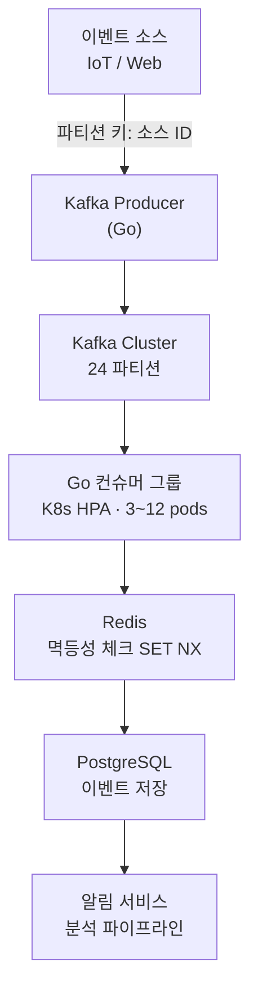

## 개요

대규모 B2B SaaS 플랫폼의 사용자 행동 이벤트를 실시간으로 수집·처리하는 파이프라인을 전면 재설계한 프로젝트입니다. 기존 배치 폴링 방식의 모놀리식 시스템을 Kafka 기반의 스트리밍 아키텍처로 전환하여 처리 용량과 안정성을 동시에 확보했습니다.

## 문제

서비스 성장으로 일일 이벤트 수가 2배씩 증가하면서 배치 기반 폴링 시스템의 한계가 드러났습니다. 피크 타임(오전 9시~10시)에는 처리 대기열이 수만 건 수준으로 쌓이고, 평균 지연이 12초를 넘어섰습니다. 이 지연은 이벤트 기반 알림 발송과 대시보드 지표 갱신에 직접 영향을 미쳤고, 일부 이벤트는 큐 오버플로우로 아예 유실되는 상황이었습니다.

근본 원인은 두 가지였습니다. 첫째, 처리 주체가 단일 프로세스로 설계되어 수평 확장이 구조적으로 불가능했습니다. 둘째, 이벤트 큐가 인메모리에 존재했기 때문에 서비스 재시작 시 데이터가 소멸되었습니다.

## 역할

이 프로젝트에서 스트리밍 파이프라인 전체를 혼자 설계하고 구현했습니다. 요구사항 분석부터 카프카 토픽 설계, Go 컨슈머 서비스 개발, Kubernetes 배포 구성, Prometheus 기반 모니터링 대시보드 구성까지 전 과정을 담당했습니다. 기존 배치 처리 시스템을 다운타임 없이 새 아키텍처로 전환하는 마이그레이션도 직접 수행했습니다.

## 아키텍처

프로듀서는 이벤트 소스 ID를 파티셔닝 키로 설정하여 Kafka에 발행합니다. Kafka 클러스터는 24개 파티션으로 구성하고, Go로 작성한 컨슈머 그룹을 Kubernetes HPA를 통해 트래픽에 따라 3~12개 파드로 자동 확장합니다. 각 컨슈머는 이벤트를 처리하기 전 Redis에 이벤트 ID를 확인해 중복을 걸러내고, 처리 완료 후 PostgreSQL에 원자적으로 기록합니다.

## 핵심 결정

### Kafka 선택 이유

높은 처리량과 재처리 가능성이 핵심 요구사항이었습니다. RabbitMQ는 복잡한 라우팅에 강하지만 메시지를 소비 후 삭제하므로 컨슈머 장애 시 데이터를 복구하기 어렵습니다. Kafka는 로그를 보존하기 때문에 컨슈머 오프셋을 되돌려 임의 시점부터 재처리할 수 있었고, 이것이 데이터 파이프라인의 안정적 운영에 결정적이었습니다.

### 파티셔닝 전략

소스 ID를 파티셔닝 키로 사용하면 같은 소스의 이벤트 순서가 보장되고 파티션 수를 늘리는 것만으로 처리량을 선형적으로 확장할 수 있습니다. 단, 특정 소스에 트래픽이 집중되는 핫스팟 문제가 발생했고, 이를 가상 샤드 방식으로 해결했습니다(아래 도전 항목 참조).

### Redis 멱등성 처리

Kafka의 At-least-once 전달 보장으로 인해 중복 메시지가 올 수 있습니다. DB 유니크 제약 조건으로 막는 방법도 있지만, 중복이 많은 경우 DB 락 경합이 발생합니다. Redis의 SET NX 명령을 이용해 이벤트 ID를 TTL 24시간으로 선점하는 방식이 락 없이 중복을 걸러낼 수 있어 선택했습니다.

## 도전과 해결

### 컨슈머 리밸런싱 중 이벤트 유실

배포 시 파드가 교체되는 과정에서 Kafka 리밸런싱이 발생하고, 이미 처리를 시작했지만 오프셋을 커밋하지 못한 메시지들이 재전송되어 일부가 중복 처리되었습니다. 오프셋 자동 커밋을 끄고(enable.auto.commit=false) 처리 완료 시점에 명시적으로 커밋하도록 변경했습니다. Kubernetes 파드 종료 시 SIGTERM을 받은 컨슈머가 최대 30초 동안 현재 처리 배치를 완료하고 커밋 후 종료하도록 Graceful shutdown을 구현했습니다.

### 핫 파티션 부하 집중

대형 고객사 한 곳의 이벤트가 전체 트래픽의 30%를 차지하면서 해당 소스 ID에 할당된 파티션 하나가 지속적으로 포화 상태가 되었습니다. 소스 ID에 가상 샤드 인덱스(0~N)를 붙여 파티셔닝 키를 `{source_id}-{shard_index}` 형태로 변경하고, 샤드 수를 소스별 처리량에 따라 동적으로 결정하는 로직을 추가했습니다. 이 변경으로 해당 소스의 부하가 8개 파티션으로 균등하게 분산되었습니다.

## 성과

전환 후 6개월간 운영 데이터를 기반으로 한 결과입니다:

- 이벤트 처리 평균 지연: **12초 → 600ms** (95% 감소)
- 피크 타임 이벤트 유실률: **0.3% → 0%** (6개월 연속 유실 없음)
- 시스템 가용성: **99.6% → 99.95%** (월간 다운타임 15분 이하)
- 최대 처리 이벤트 수: **초당 8,000건 → 240,000건** (30배 증가)
- 컨슈머 서비스 p99 응답 시간: **180ms 이하** 유지
