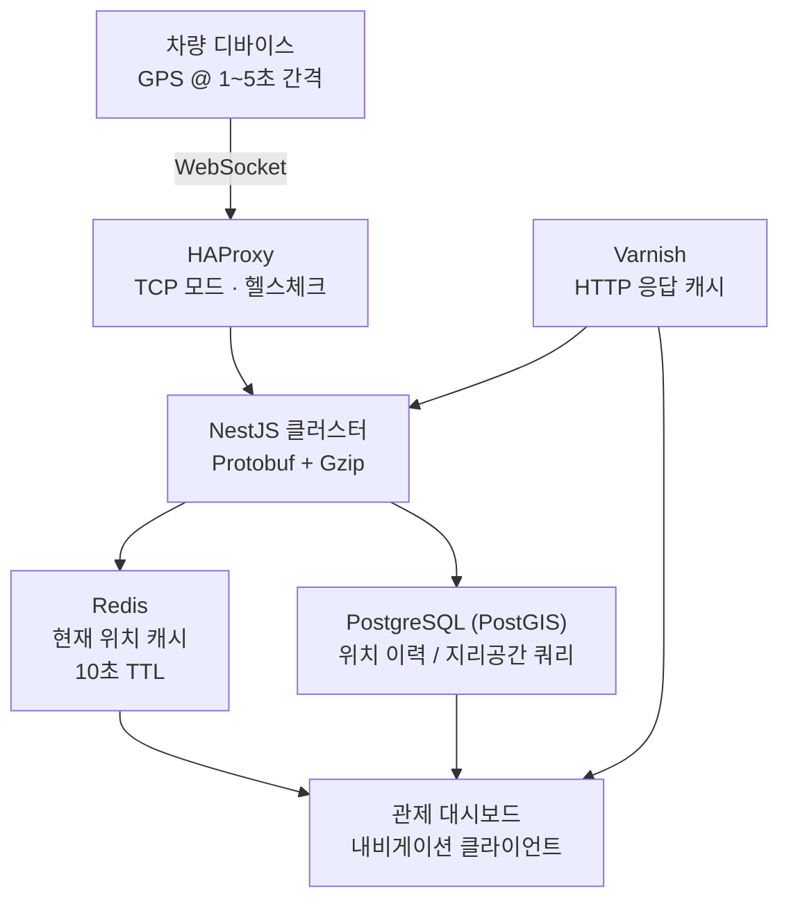

## 개요

Fatos에서 운영한 B2B 차량 관제 플랫폼의 백엔드 및 인프라 개발 사례입니다. 차량 디바이스에서 발생하는 실시간 GPS 데이터를 관제 대시보드, 내비게이션 클라이언트, 분석 파이프라인에 동시에 스트리밍하는 시스템을 설계하고 운영했습니다.

핵심 기술 과제는 네트워크 효율화, 지리공간 쿼리 성능, 차량 대수 증가에 따른 서비스 안정성 확보였습니다. 프로젝트 전반에 걸쳐 백엔드, 인프라, 데이터 레이어를 단독으로 소유하고 GCP, Azure, 온프레미스 환경을 동시에 운영했습니다.

## 문제

차량은 1~5초 간격으로 GPS 위치를 전송하며, 이 데이터는 동시에 연결된 여러 클라이언트에 팬아웃됩니다. 차량 대수가 증가하면서 세 가지 구조적 문제가 중첩되었습니다.

**네트워크 비용.** 모든 페이로드가 JSON 형식이었습니다. 소규모 차량 수에서는 대역폭 오버헤드가 수용 가능했지만, 대수가 늘면서 누적 전송량이 실제 운영 비용으로 이어졌습니다.

**데이터베이스 부하.** PostGIS 지리공간 쿼리가 캐싱 없이 매 요청마다 데이터베이스에 직접 도달했습니다. "이 위치에서 500m 내 차량을 보여줘" 형태의 근접 조회가 반복적으로 같은 쿼리를 실행했습니다.

**단일 장애 지점.** 백엔드는 단일 NestJS 프로세스가 모든 WebSocket 연결을 처리하는 구조였습니다. 피크 배차 시간대에 이 프로세스가 처리량 상한선이자 유일한 장애 지점이었습니다.

## 역할

스트리밍 파이프라인, 데이터베이스 레이어, 인프라 전반을 단독으로 소유하는 시니어 백엔드 엔지니어였습니다. Protobuf 직렬화 레이어, Redis 캐싱 전략, HAProxy 로드 밸런서 구성, Varnish 설정을 직접 설계하고 구현했습니다. 멀티클라우드 운영 환경에서 배포, 모니터링, 장애 대응도 담당했습니다.

## 아키텍처

차량 디바이스는 HAProxy를 경유해 NestJS 서버 풀에 WebSocket 연결을 유지합니다. 수신된 위치 업데이트는 PostGIS에 저장되고, 동시에 Redis의 현재 위치 캐시를 갱신합니다. HTTP 엔드포인트(경로 데이터, 존 경계 등)는 Varnish를 통해 읽기 집중 트래픽을 흡수합니다.

## 핵심 결정

### Protobuf 선택 이유

실측 데이터를 기반으로 결정했습니다. 실제 트래픽에서 GPS 업데이트 메시지의 JSON 페이로드 평균 크기를 측정한 결과 340바이트였고, 동일한 데이터를 Protobuf로 인코딩하면 약 60바이트였습니다. Gzip을 추가로 적용한 결과 일일 누적 전송량이 약 60% 감소했습니다.

트레이드오프는 디버깅 복잡도입니다. 바이너리 프레임은 일반 로그 도구로 읽을 수 없습니다. 개발 모드에서 `x-encoding: json` 헤더를 통해 JSON 폴백을 제공하여 로컬 개발 편의성을 유지했습니다.

### Redis 캐싱 전략

쿼리 패턴을 분석한 결과, 읽기 트래픽의 대부분이 각 차량의 현재 위치를 조회하는 패턴이었습니다. TTL 10초의 Redis 캐시를 PostGIS 앞에 두어 반복적인 동일 차량 위치 조회를 데이터베이스 없이 처리했습니다.

노드별 인메모리 캐시 대신 공유 Redis를 선택한 이유는 일관성 때문입니다. 인메모리 캐시는 빠르지만 노드 재시작 시 캐시가 사라지고, 멀티 노드 환경에서 캐시 데이터가 노드마다 달라질 수 있습니다.

### HAProxy TCP 모드 로드 밸런싱

WebSocket은 HTTP 업그레이드 이후 장기 연결을 유지합니다. HTTP 모드 프록시는 유휴 연결을 끊을 수 있어 WebSocket에 적합하지 않습니다. HAProxy를 TCP 모드로 구성하면 연결을 그대로 통과시키면서도 헬스체크 기반의 노드 제외가 가능합니다. 비정상 노드를 10초 이내에 라우팅에서 제외하도록 설정해, 롤링 배포 중에도 클라이언트 연결 끊김을 최소화했습니다.

## 도전과 해결

### GeoJSON 응답 병목

경로 형상, 존 경계, 지도 오버레이를 제공하는 API 엔드포인트가 수백 킬로바이트의 GeoJSON을 반환하면서 클라이언트 렌더링 지연이 발생했습니다.

응답 경로를 프로파일링한 결과 두 가지 병목이 있었습니다. 첫째, PostGIS에서 도형 데이터를 GeoJSON으로 직렬화하는 과정이 Node.js 이벤트 루프를 차단했습니다. 둘째, Gzip 압축이 전체 응답 조합 이후에 일괄 적용되고 있었습니다. 도형 직렬화를 워커 풀로 분리하고, 응답 스트림에 스트리밍 Gzip을 적용해 이벤트 루프 차단과 피크 메모리 사용량을 개선했습니다.

### 라이브 클라이언트 대상 Protobuf 전환

기존 클라이언트가 운영 중인 상태에서 Protobuf를 도입하려면 전환 기간 동안 JSON과 Protobuf를 동시에 지원해야 했습니다. WebSocket 핸드셰이크 단계에서 `x-encoding` 헤더로 인코딩 방식을 협상하도록 구현했습니다. 클라이언트를 단계적으로 전환할 수 있었고, 스키마 변경은 전환 완료 전까지 기존 필드에 영향을 주지 않는 추가만 허용했습니다.

## 성과

Fatos 운영 기간(2022–2025) 동안의 측정 결과입니다:

- 네트워크 전송량: Protobuf + Gzip 도입 후 **약 60% 감소**
- PostGIS 쿼리 부하: Redis 현재 위치 캐시 도입으로 직접 쿼리 대폭 감소
- 서비스 가용성: 단일 노드 구조에서 HAProxy 기반 멀티 노드 구조로 개선
- GeoJSON 엔드포인트: 스트리밍 Gzip 및 워커 풀 적용 후 응답 시간 개선
- **GCP, Azure, 온프레미스** 세 환경에서 동시 운영
