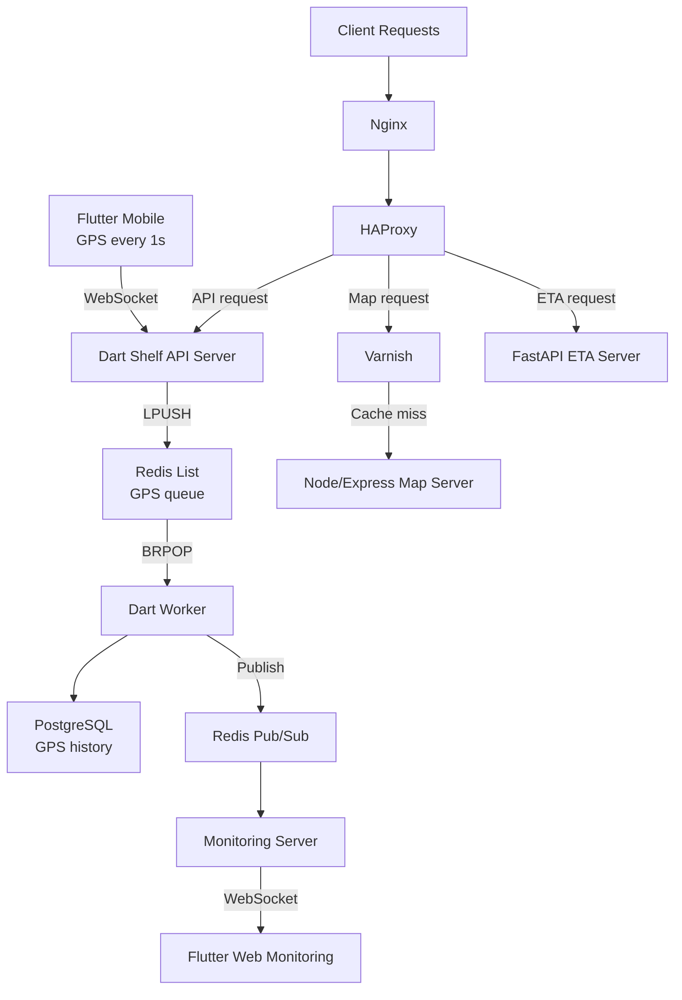

## 개요

Fatos에서 2022년부터 2025년까지 운영한 실시간 차량 관제 플랫폼입니다. Flutter 모바일 앱이 1초마다 GPS를 전송하고, 브라우저 기반 대시보드가 차량 위치를 실시간으로 보여주며, 여러 백엔드 서비스와 Redis 파이프라인, PostgreSQL, 프록시/캐시 레이어가 Azure 환경에서 이를 연결했습니다.

이 시스템의 핵심 도전은 특별히 어려운 알고리즘이 아니었습니다. 느려지면 안 되는 수집 경로, 동시에 유지해야 하는 실시간 피드와 영속 이력, 성격이 판이하게 다른 세 가지 트래픽 유형 — 이 조합을 하나의 인프라 위에서 다루는 일이었습니다. 저는 3인 팀 안에서 클라이언트 코드부터 API 설계, 데이터베이스 스키마, 프록시 규칙, 캐시 정책, CI/CD까지 플랫폼 전체를 맡았습니다.

소스 코드는 공개할 수 없으며, 이 문서는 아키텍처와 설계 결정에 집중합니다.

## 문제

**GPS는 1초마다 오고, 기다려주지 않는다.** 모바일 앱은 정확히 1초 간격으로 GPS를 전송했습니다. 이 빈도에서는 WebSocket 핸들러 안에서 발생하는 지연이 모든 활성 단말에 즉시 복합적으로 쌓입니다. 수신 서버는 빠르게 받고 넘기는 일에만 집중해야 했고, 저장이나 하위 처리를 인라인으로 수행할 여유가 없었습니다.

**같은 데이터가 두 곳으로 동시에 가야 한다.** 모든 GPS 프레임은 PostgreSQL에 이력으로 남아야 했고, 동시에 웹 대시보드에 거의 즉시 반영되어야 했습니다. 직관적인 방법인 "저장 후 전송"은 모니터링 지연을 데이터베이스 쓰기 지연에 직접 묶어버립니다. 그 구조는 허용할 수 없었습니다.

**트래픽 유형이 세 가지, 인프라는 하나.** 실시간 API, ETA 계산, 지도 타일 요청은 부하 특성이 달랐습니다. 지도는 캐시 가능하고 용량이 크며, WebSocket 프레임은 작고 연속적이며, ETA는 CPU 집약적이고, 수집은 I/O 중심입니다. 이들을 동일하게 다루면 한 경로의 문제가 나머지 전체로 번집니다.

## 역할

3인 팀(저, 프론트엔드 개발자 1명, CTO 1명) 안에서 제가 직접 설계하고 구현한 범위입니다.

- Dart Shelf 메인 API 서버와 Redis 수집 파이프라인
- 큐 소비, DB 쓰기, Pub/Sub 발행을 담당하는 Dart Worker
- FastAPI ETA 서비스와 Node/Express 지도 서버
- PostgreSQL 스키마 설계
- Nginx, HAProxy, Varnish 구성
- Jenkins CI/CD와 Azure 인프라 설정
- Flutter 모바일 앱의 WebSocket 통신 구간
- Flutter Web 대시보드의 GPS 수신 구간

하나의 서비스가 아니라 하나의 제품 흐름 전체를 책임지는 역할이었습니다.

## 아키텍처

GPS는 1초마다 폰을 떠나 WebSocket으로 전달됩니다. Dart Shelf 서버는 이 프레임을 받아 Redis에 LPUSH하고 끝입니다. Dart Worker가 BRPOP으로 꺼내 PostgreSQL에 저장하는 동시에 Redis Pub/Sub으로 이벤트를 발행합니다. 모니터링 서버는 이를 구독해 Flutter Web 대시보드로 전달합니다.

HTTP 경로는 별도로 흐릅니다. Nginx가 진입점을 맡고, HAProxy가 요청 성격에 따라 분기합니다. 지도 요청은 먼저 Varnish를 거칩니다. 캐시 히트는 즉시 응답하고, 미스만 Node/Express 지도 서버로 전달됩니다. ETA 요청은 FastAPI로, 나머지 API 요청은 Dart 서버로 갑니다.

두 경로를 분리한 이유가 있습니다. 실시간 수집은 소량의 데이터가 고빈도로 연속 유입되는 I/O 집약적 스트림이고, HTTP 경로는 CPU 연산이나 대용량 응답이 섞인 전혀 다른 성격의 트래픽입니다. 한 서버에 넣으면 한쪽이 다른 쪽의 발목을 잡는 상황이 발생합니다.

## 핵심 결정

### WebSocket 서버를 쓰기 경로 밖에 두기

가장 직관적인 설계는 수집 서버가 GPS를 받아 PostgreSQL에 저장하고, 모니터링 서버에 푸시한 뒤 응답하는 것입니다. 소규모에서는 잘 동작합니다. 하지만 1초 간격의 실제 차량 규모에서는 데이터베이스 쓰기 지연과 모니터링 팬아웃 지연이 모두 수집 지연으로 직결됩니다.

그래서 Dart 서버를 전달 지점으로만 설계했습니다. 프레임을 받아 Redis에 LPUSH하고 끝. Worker가 BRPOP으로 나머지를 처리합니다. 컴포넌트는 늘어나지만 장애 경계가 생깁니다. 데이터베이스 슬로우다운이나 모니터링 부하가 GPS 수신 성능을 끌어내리지 않게 됩니다. 수집 서버가 할 일이 단순해질수록, 나쁜 날이 줄어듭니다.

### 세 가지 서비스를 하나로 합치지 않은 이유

실시간 수집, ETA 로직, 지도 서빙을 하나의 백엔드로 합치는 선택도 있었습니다. 배포가 단순해졌을 것입니다. 그러나 각 워크로드의 장애 모드와 확장 특성이 실제로 다릅니다.

지속적인 GPS 부하 아래의 WebSocket 서버는 경로 계산을 수행하는 FastAPI 서비스와 동작 방식이 다릅니다. 지도 서빙은 캐시 히트/미스에 지배됩니다. 한곳에 모으면 한 워크로드가 다른 워크로드에 예측하기 어려운 영향을 줍니다. 서비스를 분리함으로써 각 컴포넌트의 동작을 독립적으로 관찰하고 조정할 수 있게 됐습니다.

### 캐시 정책은 애플리케이션이 아닌 인프라 계층에서

지도 타일은 캐시 가능한 트래픽입니다. Node/Express 서버 내부에서 캐싱을 구현할 수도 있었지만, HAProxy 뒤에 Varnish를 두는 방식을 택했습니다.

이점은 명확성입니다. 라우팅과 캐시 정책이 인프라 계층에서 관찰 가능해집니다. 캐시 동작이 예상과 다를 때 HAProxy와 Varnish 로그가 먼저 답을 줍니다. 애플리케이션 코드를 뒤질 필요가 없습니다. 지도 서버는 캐시 히트를 전혀 처리하지 않습니다. 서버 코드는 단순하고, 캐시 경계는 선명합니다.

### GPS 프레임에 Protobuf와 Gzip 적용

모든 활성 단말이 1초마다 GPS를 전송합니다. 이 빈도에서는 인코딩 오버헤드와 페이로드 크기가 전체 차량 수에 걸쳐 복합적으로 누적됩니다. JSON은 읽기 쉽지만, 각 GPS 프레임이 실제 데이터보다 훨씬 많은 바이트를 포함합니다.

GPS 프레임 직렬화를 JSON에서 Protocol Buffers로 교체하고 Gzip 압축을 추가했습니다. 그 결과 기존 JSON 대비 네트워크 전송량이 약 60% 줄었습니다. 수집 계층을 최대한 가볍게 유지하도록 설계된 파이프라인에서, 프레임 크기 축소는 WebSocket 핸들러, Redis, 다운스트림 소비자 전체의 부담을 함께 낮추는 효과로 이어졌습니다.

## 도전과 해결

### 수집 경로는 나쁜 날이 없어야 한다

1초 간격은 여유가 없습니다. 수집 서버가 느려지면 — 데이터베이스를 기다리거나, 다운스트림 구독자가 느리거나, Worker가 밀려있거나 — 지연이 모든 활성 단말에 즉시 복합적으로 쌓입니다.

해결책은 아키텍처였습니다. WebSocket 핸들러에서 작업을 빼내 Redis 기반 소비자에게 맡기면, 핸들러의 역할은 단순해집니다. 바이트를 받아 큐에 넣는 일. Redis 자체에 문제가 생기지 않는 한 느려지지 않습니다. 이것은 훨씬 좁은 장애 표면입니다.

### 실시간과 영속, 두 마리 토끼

웹 대시보드는 실시간처럼 느껴져야 했고, 데이터베이스에는 권위 있는 이력이 쌓여야 했습니다. 두 요구는 따로 만족시키기는 쉽지만, 하나의 코드 경로에서 함께 다루면 긴장이 생깁니다.

해결 방법은 실시간 피드를 데이터베이스 읽기 경로로 돌리지 않는 것이었습니다. Worker가 PostgreSQL에 저장하는 동시에 Pub/Sub으로 발행합니다. 모니터링 서버는 DB 조회가 아니라 Pub/Sub을 구독합니다. 대시보드는 거의 실시간에 가깝게 반응하고, 데이터베이스에는 깔끔한 이력이 쌓입니다. 두 경로가 서로를 방해하지 않습니다.

### 여섯 개 기술 레이어를 혼자 유지하기

가장 어려운 운영 과제는 Flutter, Dart, Python, Node, PostgreSQL, 프록시 스택 전체에 걸쳐 일관성을 유지하는 것이었습니다. WebSocket 메시지 형식 변경, 스키마 마이그레이션, HAProxy 규칙 수정 — 한 계층의 변화는 나머지 전체에 일관되게 반영되어야 했습니다.

이것은 할 일 목록으로 깔끔하게 정리되지 않는 종류의 작업입니다. 다수의 팀원이 없는 상황에서 멀티 스택 시스템의 이해 가능성을 유지하는 판단력이 요구됩니다. 이 지점이 이 프로젝트에서 가장 시니어한 역할이 요구된 부분이기도 합니다.

## 성과

Fatos에서 2022년부터 2025년까지 운영하며 확인한 결과입니다.

- Redis를 명시적 전달 계층으로 삼아 모바일 수집부터 브라우저 실시간 모니터링까지의 GPS 파이프라인을 구축
- 수집, 영속 저장, 실시간 팬아웃, ETA, 지도 서빙 다섯 가지 관심사를 명확한 운영 경계로 분리
- 지도 트래픽을 Varnish와 Node/Express 뒤로 격리해 메인 API 경로가 지도 부하에 영향받지 않도록 처리
- 백엔드 서비스, 데이터베이스 설계, 프록시 설정, Jenkins CI/CD, Azure 인프라를 하나의 통합된 시스템으로 구축 및 운영
- 모바일, 웹, 백엔드, 운영 레이어가 처음부터 하나의 제품 흐름으로 동작하도록 설계
- Protobuf 직렬화와 Gzip 압축을 GPS 프레임에 적용해 네트워크 전송량을 약 60% 절감하고 응답 속도 개선

## 다음에 개선할 것

시스템이 계속 진화한다면 세 가지에 집중할 것입니다.

**관측 가능성.** 큐 적체, Worker 지연, WebSocket 연결 상태, 경로별 캐시 히트율을 지속적으로 관찰할 수 있어야 합니다. 지금은 용량 결정이 측정보다 경험에 의존하는 부분이 있습니다.

**큐 경로의 장애 처리.** Worker가 처리 중 실패했을 때의 명시적인 동작이 부족합니다. 재시도 정책, 데드레터 큐, 재처리 절차를 갖추면 프로덕션 대응력이 높아집니다.

**크로스 런타임 배포 안정성.** Dart, Python, Node, Flutter를 아우르는 변경은 현재 관리 가능하지만 주의가 필요합니다. 더 나은 계약 검증과 배포 자동화로 불일치 롤아웃의 위험을 줄일 수 있습니다.
